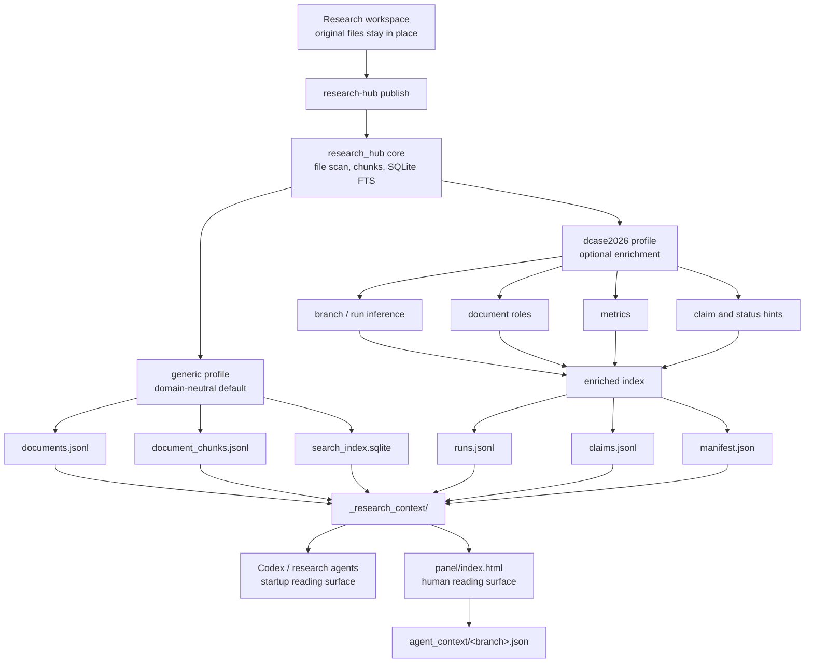

# research-hub-skills

Domain-neutral, index-first research workspace context layer for Codex and
other AI agents.

This project does not require NAS. It supports three hub modes:

1. local mode: `.research_hub_local`,
2. shared folder mode: any mounted or synced path, and
3. Git state hub mode: a separate cloned repository used as shared state.

## Architecture



The generated context and panel are projections. The original workspace files
remain the source of truth.

## One-command workspace install

```bash
git clone https://github.com/UTurtle/research-hub-skills.git \
  .research-hub-skills
bash .research-hub-skills/scripts/install_workspace.sh
codex
```

## Manual use

```bash
export PYTHONPATH="$PWD/.research-hub-skills/src:${PYTHONPATH:-}"
export RESEARCH_HUB="${RESEARCH_HUB:-$PWD/.research_hub_local}"
export RESEARCH_WORKSPACE_ID="${RESEARCH_WORKSPACE_ID:-$(basename "$PWD")}"
export RESEARCH_HOST_ID="${RESEARCH_HOST_ID:-local}"

python -m research_hub.cli init --workspace-root .
python -m research_hub.cli publish --workspace-root .
python -m research_hub.cli pull-context --workspace-root .
python -m research_hub.cli open --workspace-root .
```

## Optional DCASE2026 profile

The default profile stays domain-neutral. For DCASE2026-style workspaces, add
`--profile dcase2026` to enrich the index with inferred branches, runs,
document roles, metrics, claim hints, and status hints.

```bash
python -m research_hub.cli publish --workspace-root . \
  --profile dcase2026
python -m research_hub.cli pull-context --workspace-root . \
  --profile dcase2026
```

Profile outputs include:

- `runs.jsonl`
- `claims.jsonl`
- `manifest.json`
- `panel/index.html`
- `panel/agent_context/<branch>.json`

The generated records are navigation aids only. Source workspace files remain
authoritative, and uncertain claims should stay marked as `unknown` or
`needs_review`.

## Git state hub mode

Use a separate private state repository as the hub.

```bash
git clone https://github.com/<owner>/<private-research-hub-state>.git \
  .research_hub_state
research-hub publish --hub .research_hub_state
research-hub sync-push --hub .research_hub_state
```

On another machine:

```bash
git clone https://github.com/<owner>/<private-research-hub-state>.git \
  .research_hub_state
research-hub sync-pull --hub .research_hub_state
research-hub pull-context --hub .research_hub_state
```

## Default indexed files

Included: `.md`, `.txt`, `.csv`, `.json`, `.jsonl`, `.yaml`, `.yml`,
`.log`, `.py`, `.sh`, `.toml`, `.ini`, `.cfg`.

Excluded: audio files, checkpoints, NumPy arrays, virtual environments,
`.git`, `wandb`, caches, and `node_modules`.

## License

Apache License 2.0.
