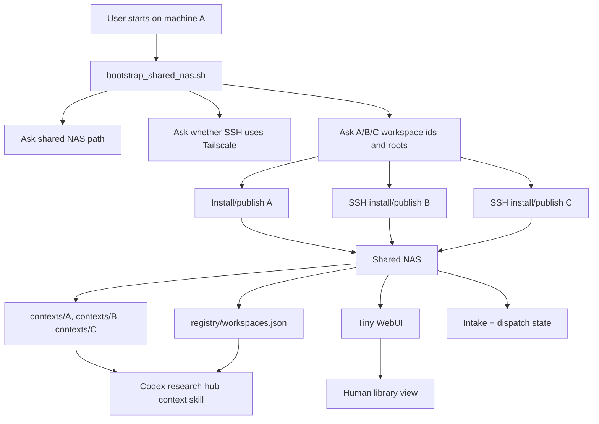

# research-hub-skills

Shared-NAS research workspace context layer for Codex and other agents.

The current design assumes several Linux research machines can all see the same
NAS path. Original research files stay in each workspace. The NAS stores only
lightweight indexes, context projections, registry records, intake items, and
small UI state.

Recommended default:

```text
A/B/C workspaces
  original repos, notes, logs, md/txt files stay in place
  daily publish writes index/context to the shared NAS

Shared NAS
  registry/workspaces.json
  index/<workspace-id>/
  contexts/<workspace-id>/
  snapshots/<workspace-id>/
  intake/
  panel/

Codex / agents
  read _research_context locally first
  read NAS registry/snapshots for cross-workspace work
  fetch original source paths only when evidence is needed
```

The older SSH-pull/central-refresh design is preserved at
[`codex/legacy-ssh-refresh-v0.1`](https://github.com/UTurtle/research-hub-skills/tree/codex/legacy-ssh-refresh-v0.1).

## Why

Research workspaces tend to be scattered: repos, markdown notes, text logs,
experiment outputs, paper drafts, and related-work notes live across multiple
machines. Research Hub makes those scattered workspaces feel like one library
without moving the original files.

It is intentionally lazy:

- no heavy database server,
- no live Git sync for generated indexes,
- no mandatory vector database,
- no raw research file migration,
- daily or foreground refresh is enough for most research notes.

## Main Workflow



Start from one coordinator machine:

```bash
git clone https://github.com/UTurtle/research-hub-skills.git .research-hub-skills
bash .research-hub-skills/scripts/install_codex_skills.sh
bash .research-hub-skills/scripts/bootstrap_shared_nas.sh
```

The bootstrap is dry-run by default. It asks:

- shared NAS hub path, for example `/mnt/nas/research_hub`,
- whether to use Tailscale hostnames/IPs for SSH,
- local workspace id/root,
- remote workspace SSH target and root,
- whether to install daily timers.

After reviewing the dry-run:

```bash
bash .research-hub-skills/scripts/bootstrap_shared_nas.sh --execute
```

## Install Modes

Install Codex skills only:

```bash
curl -fsSL https://raw.githubusercontent.com/UTurtle/research-hub-skills/main/install.sh | bash
```

Install one workspace directly:

```bash
export RESEARCH_HUB="/mnt/nas/research_hub"
export RESEARCH_WORKSPACE_ID="B"
bash .research-hub-skills/scripts/install_workspace.sh /mnt/ssd/B
```

Install daily background publishing on Linux:

```bash
RESEARCH_HUB=/mnt/nas/research_hub \
RESEARCH_WORKSPACE_ID=B \
bash .research-hub-skills/scripts/install_user_timer.sh /mnt/ssd/B
```

The timer defaults to `daily`. Override with `RESEARCH_HUB_TIMER_INTERVAL`, for
example `hourly` or `*-*-* 03:00:00`.

## Runtime Use

Local refresh:

```bash
python -m research_hub.cli publish \
  --hub /mnt/nas/research_hub \
  --workspace-root /mnt/ssd/B \
  --workspace-id B
```

Foreground watch when a terminal/supervisor is available:

```bash
python -m research_hub.cli watch \
  --hub /mnt/nas/research_hub \
  --workspace-root /mnt/ssd/B \
  --workspace-id B \
  --interval 30
```

Refresh hub snapshot status from the NAS registry:

```bash
python -m research_hub.cli refresh-hub --hub /mnt/nas/research_hub
python -m research_hub.cli index-status --hub /mnt/nas/research_hub
```

Run the tiny WebUI on a Linux/NAS-visible machine:

```bash
python -m research_hub.cli web \
  --hub /mnt/nas/research_hub \
  --host 127.0.0.1 \
  --port 8787
```

From Windows or another client:

```powershell
ssh -L 8787:127.0.0.1:8787 user@linux-a
```

Open `http://127.0.0.1:8787`.

## What Stays From The Older Design

Keep:

- tiny server-rendered WebUI,
- NAS as the direct place to read generated context and small uploaded files,
- manifest-first collection and `root_hash` skip logic,
- SSH transport as a fallback or remote bootstrap channel,
- inbox/dispatch JSON flow for agent-approved placement requests.

De-emphasize:

- Git as a live generated-state bus,
- central machine pulling everything by default,
- copying raw research files into the hub.

## Skills

`research-hub-install`:
install, bootstrap shared NAS, ask for Tailscale/SSH details, connect
workspaces, and install timers.

`research-hub-context`:
runtime reading skill. It should trigger when the user asks for document
aggregation, related work, reports, cross-workspace comparison, overall research
state, or paper-writing context.

Other research skills remain smaller helpers for indexing, publishing,
literature organization, documentation patching, and discussion synthesis.

## Generated Context

Each workspace gets:

```text
RESEARCH_HUB.md
AGENTS.md
_research_context/
  START_HERE.md
  manifest.json
  documents.jsonl
  document_chunks.jsonl
  source_links.jsonl
  search_index.sqlite
```

The NAS gets:

```text
registry/workspaces.json
index/<workspace-id>/
contexts/<workspace-id>/
snapshots/<workspace-id>/latest/
intake/
outbox/
panel/
```

Agents should treat generated files as navigation aids. Original source paths
remain authoritative.

## Domain Profiles

The default profile is generic. Optional profiles can enrich the index with
domain-specific records.

```bash
python -m research_hub.cli publish \
  --hub /mnt/nas/research_hub \
  --workspace-root . \
  --workspace-id dcase \
  --profile dcase2026
```

The DCASE2026 profile adds inferred runs, metrics, claims, status hints, and
claim-boundary aids. These are still evidence pointers, not replacement truth.

## Indexed Files

Included by default: `.md`, `.txt`, `.csv`, `.json`, `.jsonl`, `.yaml`,
`.yml`, `.log`, `.py`, `.sh`, `.toml`, `.ini`, `.cfg`.

Excluded by default: audio files, checkpoints, NumPy arrays, virtual
environments, `.git`, `wandb`, caches, and `node_modules`.

## File Split

Runtime/install files:

- `src/research_hub/`
- `skills/`
- `templates/`
- `scripts/`
- `docs/INSTALL.md`
- `docs/intake-dispatch.md`

Development files:

- `tests/`
- `docs/dev/`
- `docs/integrations.md`
- `docs/oss-reuse.md`
- `docs/oss-ui-shortlist.md`

See `install/manifest.json`.

## License

Apache License 2.0.
