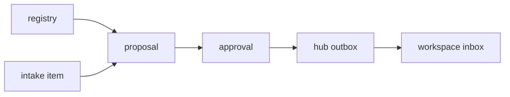

# Lazy Workspace Intake Dispatch Implementation Plan

> **For agentic workers:** REQUIRED SUB-SKILL: Use superpowers:subagent-driven-development (recommended) or superpowers:executing-plans to implement this plan task-by-task. Steps use checkbox (`- [ ]`) syntax for tracking.

**Goal:** Build the first file-based intake-to-inbox loop for an agent-driven lazy workspace skill.

**Architecture:** Keep the hub as a non-driving control plane: it records uploads, proposes routes, waits for approval, and writes inbox requests. Local workspace agents remain responsible for concrete edits and experiments after they receive approved requests.

**Tech Stack:** Python standard library, JSON/JSONL ledgers, pathlib/shutil/zipfile, existing SQLite FTS index outputs, existing static panel generator, optional future MarkItDown/Pydantic adapters.

---

## Scope

This plan implements the P0 loop only:



The implementation must not move or rewrite original workspace files. It may
copy uploaded material into the hub intake blob store and write generated
request records into inbox directories.

## File Structure

- Create `src/research_hub/jsonl.py`: shared JSONL helpers with deterministic append/read behavior.
- Create `src/research_hub/registry.py`: workspace registry schema, storage policy, and registry commands.
- Create `src/research_hub/intake.py`: intake item creation, blob copy/extract, and intake ledger.
- Create `src/research_hub/dispatch.py`: proposal scoring, approval, outbox request creation.
- Create `src/research_hub/inbox.py`: workspace inbox writer and status updater.
- Modify `src/research_hub/cli.py`: add `registry`, `intake`, `dispatch`, and `inbox` subcommands.
- Modify `src/research_hub/panel.py`: add static intake/proposal sections when ledgers exist.
- Create `docs/intake-dispatch.md`: operator protocol for humans and local agents.
- Create tests:
  - `tests/test_jsonl_helpers.py`
  - `tests/test_workspace_registry.py`
  - `tests/test_intake.py`
  - `tests/test_dispatch.py`
  - `tests/test_inbox.py`

## Task 1: Shared JSONL Helpers

**Files:**

- Create: `src/research_hub/jsonl.py`
- Test: `tests/test_jsonl_helpers.py`

- [ ] **Step 1: Write the failing JSONL tests**

Create `tests/test_jsonl_helpers.py`:

```python
from research_hub.jsonl import append_jsonl, read_jsonl, write_json


def test_append_jsonl_creates_parent_and_preserves_order(tmp_path):
    path = tmp_path / "state" / "items.jsonl"

    append_jsonl(path, {"id": "a", "value": 1})
    append_jsonl(path, {"id": "b", "value": 2})

    assert read_jsonl(path) == [
        {"id": "a", "value": 1},
        {"id": "b", "value": 2},
    ]


def test_read_jsonl_ignores_blank_lines(tmp_path):
    path = tmp_path / "items.jsonl"
    path.write_text('{"id": "a"}\n\n{"id": "b"}\n', encoding="utf-8")

    assert read_jsonl(path) == [{"id": "a"}, {"id": "b"}]


def test_write_json_creates_parent_and_sorts_keys(tmp_path):
    path = tmp_path / "nested" / "record.json"

    write_json(path, {"z": 1, "a": 2})

    text = path.read_text(encoding="utf-8")
    assert text.startswith("{\n  \"a\": 2,")
```

- [ ] **Step 2: Run the failing tests**

Run:

```bash
PYTHONPATH=src python -m pytest tests/test_jsonl_helpers.py -v
```

Expected: import error for `research_hub.jsonl`.

- [ ] **Step 3: Implement JSONL helpers**

Create `src/research_hub/jsonl.py`:

```python
"""Small JSON and JSONL helpers for hub ledgers."""

from __future__ import annotations

import json
from pathlib import Path
from typing import Any


def read_jsonl(path: Path) -> list[dict[str, Any]]:
    if not path.exists():
        return []
    records: list[dict[str, Any]] = []
    for line in path.read_text(encoding="utf-8", errors="replace").splitlines():
        if not line.strip():
            continue
        records.append(json.loads(line))
    return records


def append_jsonl(path: Path, record: dict[str, Any]) -> None:
    path.parent.mkdir(parents=True, exist_ok=True)
    with path.open("a", encoding="utf-8") as file_obj:
        file_obj.write(json.dumps(record, ensure_ascii=False, sort_keys=True))
        file_obj.write("\n")


def write_json(path: Path, record: dict[str, Any]) -> None:
    path.parent.mkdir(parents=True, exist_ok=True)
    path.write_text(
        json.dumps(record, ensure_ascii=False, indent=2, sort_keys=True) + "\n",
        encoding="utf-8",
    )
```

- [ ] **Step 4: Verify tests pass**

Run:

```bash
PYTHONPATH=src python -m pytest tests/test_jsonl_helpers.py -v
```

Expected: `3 passed`.

- [ ] **Step 5: Commit**

Run:

```bash
git add src/research_hub/jsonl.py tests/test_jsonl_helpers.py
git commit -m "Add JSONL ledger helpers"
```

## Task 2: Workspace Registry

**Files:**

- Create: `src/research_hub/registry.py`
- Modify: `src/research_hub/cli.py`
- Test: `tests/test_workspace_registry.py`

- [ ] **Step 1: Write registry tests**

Create `tests/test_workspace_registry.py`:

```python
import json

from research_hub.registry import (
    WorkspaceRecord,
    add_workspace,
    default_registry,
    load_registry,
    select_archive_workspace,
)


def test_default_registry_is_empty():
    assert default_registry() == {"workspaces": []}


def test_add_workspace_writes_registry(tmp_path):
    hub = tmp_path / "hub"

    add_workspace(
        hub,
        WorkspaceRecord(
            workspace_id="A",
            machine_role="3090",
            storage_role="archive_hdd",
            root_hint="/workspace/A",
            tailnet_hint="a-machine.tailnet",
            inbox_path="inbox/A",
            can_store_library_blobs=True,
            can_run_training=True,
            capabilities=["cuda", "torch", "dcase2026"],
        ),
    )

    registry = load_registry(hub)
    assert registry["workspaces"][0]["workspace_id"] == "A"
    assert registry["workspaces"][0]["can_store_library_blobs"] is True


def test_replacing_workspace_keeps_single_record(tmp_path):
    hub = tmp_path / "hub"
    record = WorkspaceRecord(
        workspace_id="B",
        machine_role="4080",
        storage_role="research_ssd",
        root_hint="/workspace/B",
        tailnet_hint="b-machine.tailnet",
        inbox_path="inbox/B",
        can_store_library_blobs=False,
        can_run_training=True,
        capabilities=["cuda", "torch"],
    )

    add_workspace(hub, record)
    add_workspace(hub, record)

    assert len(load_registry(hub)["workspaces"]) == 1


def test_archive_selection_excludes_research_ssd(tmp_path):
    hub = tmp_path / "hub"
    add_workspace(
        hub,
        WorkspaceRecord(
            workspace_id="B",
            machine_role="4080",
            storage_role="research_ssd",
            root_hint="/workspace/B",
            tailnet_hint="b-machine.tailnet",
            inbox_path="inbox/B",
            can_store_library_blobs=False,
            can_run_training=True,
            capabilities=["cuda"],
        ),
    )
    add_workspace(
        hub,
        WorkspaceRecord(
            workspace_id="A",
            machine_role="3090",
            storage_role="archive_hdd",
            root_hint="/workspace/A",
            tailnet_hint="a-machine.tailnet",
            inbox_path="inbox/A",
            can_store_library_blobs=True,
            can_run_training=True,
            capabilities=["cuda"],
        ),
    )

    assert select_archive_workspace(load_registry(hub))["workspace_id"] == "A"
```

- [ ] **Step 2: Run the failing tests**

Run:

```bash
PYTHONPATH=src python -m pytest tests/test_workspace_registry.py -v
```

Expected: import error for `research_hub.registry`.

- [ ] **Step 3: Implement registry module**

Create `src/research_hub/registry.py`:

```python
"""Workspace registry for distributed Research Hub routing."""

from __future__ import annotations

from dataclasses import asdict, dataclass, field
from pathlib import Path
from typing import Any

from research_hub.jsonl import write_json


REGISTRY_PATH = Path("registry") / "workspaces.json"


@dataclass(frozen=True)
class WorkspaceRecord:
    workspace_id: str
    machine_role: str
    storage_role: str
    root_hint: str
    tailnet_hint: str
    inbox_path: str
    can_store_library_blobs: bool
    can_run_training: bool
    capabilities: list[str] = field(default_factory=list)


def default_registry() -> dict[str, list[dict[str, Any]]]:
    return {"workspaces": []}


def registry_path(hub_root: Path) -> Path:
    return hub_root / REGISTRY_PATH


def load_registry(hub_root: Path) -> dict[str, Any]:
    path = registry_path(hub_root)
    if not path.exists():
        return default_registry()
    import json

    return json.loads(path.read_text(encoding="utf-8"))


def save_registry(hub_root: Path, registry: dict[str, Any]) -> None:
    write_json(registry_path(hub_root), registry)


def add_workspace(hub_root: Path, record: WorkspaceRecord) -> dict[str, Any]:
    registry = load_registry(hub_root)
    records = [
        item for item in registry["workspaces"]
        if item.get("workspace_id") != record.workspace_id
    ]
    records.append(asdict(record))
    records.sort(key=lambda item: item["workspace_id"])
    registry["workspaces"] = records
    save_registry(hub_root, registry)
    return registry


def select_archive_workspace(registry: dict[str, Any]) -> dict[str, Any] | None:
    candidates = [
        item for item in registry.get("workspaces", [])
        if item.get("storage_role") == "archive_hdd"
        and item.get("can_store_library_blobs") is True
    ]
    if not candidates:
        return None
    return sorted(candidates, key=lambda item: item["workspace_id"])[0]
```

- [ ] **Step 4: Wire CLI registry commands**

Modify `src/research_hub/cli.py` to add `registry-init` and `registry-add`
subcommands while preserving existing commands.

Add imports:

```python
from research_hub.registry import (
    WorkspaceRecord,
    add_workspace,
    default_registry,
    registry_path,
    save_registry,
)
```

Add subparsers before `args = parser.parse_args(argv)`:

```python
    registry_init = subparsers.add_parser("registry-init")
    registry_init.add_argument("--hub", default=os.environ.get("RESEARCH_HUB", ".research_hub_local"))

    registry_add = subparsers.add_parser("registry-add")
    registry_add.add_argument("--hub", default=os.environ.get("RESEARCH_HUB", ".research_hub_local"))
    registry_add.add_argument("--workspace-id", required=True)
    registry_add.add_argument("--machine-role", required=True)
    registry_add.add_argument("--storage-role", choices=("archive_hdd", "research_ssd", "scratch"), required=True)
    registry_add.add_argument("--root-hint", required=True)
    registry_add.add_argument("--tailnet-hint", default="")
    registry_add.add_argument("--inbox-path", required=True)
    registry_add.add_argument("--can-store-library-blobs", action="store_true")
    registry_add.add_argument("--can-run-training", action="store_true")
    registry_add.add_argument("--capability", action="append", default=[])
```

Add command handling after `args = parser.parse_args(argv)` and before common
workspace path resolution:

```python
    if args.command == "registry-init":
        hub_root = Path(args.hub).resolve()
        save_registry(hub_root, default_registry())
        print(registry_path(hub_root))
        return
    if args.command == "registry-add":
        hub_root = Path(args.hub).resolve()
        add_workspace(
            hub_root,
            WorkspaceRecord(
                workspace_id=args.workspace_id,
                machine_role=args.machine_role,
                storage_role=args.storage_role,
                root_hint=args.root_hint,
                tailnet_hint=args.tailnet_hint,
                inbox_path=args.inbox_path,
                can_store_library_blobs=args.can_store_library_blobs,
                can_run_training=args.can_run_training,
                capabilities=args.capability,
            ),
        )
        print(registry_path(hub_root))
        return
```

- [ ] **Step 5: Verify registry tests and CLI smoke**

Run:

```bash
PYTHONPATH=src python -m pytest tests/test_workspace_registry.py -v
PYTHONPATH=src python -m research_hub.cli registry-init --hub .tmp-hub
PYTHONPATH=src python -m research_hub.cli registry-add --hub .tmp-hub --workspace-id A --machine-role 3090 --storage-role archive_hdd --root-hint A --inbox-path inbox/A --can-store-library-blobs --can-run-training --capability cuda --capability torch
```

Expected: tests pass and `.tmp-hub/registry/workspaces.json` is printed by both
commands.

- [ ] **Step 6: Commit**

Run:

```bash
git add src/research_hub/registry.py src/research_hub/cli.py tests/test_workspace_registry.py
git commit -m "Add workspace registry"
```

## Task 3: Intake Ledger And Blob Store

**Files:**

- Create: `src/research_hub/intake.py`
- Modify: `src/research_hub/cli.py`
- Test: `tests/test_intake.py`

- [ ] **Step 1: Write intake tests**

Create `tests/test_intake.py`:

```python
from pathlib import Path

from research_hub.intake import create_intake_item, load_intake_items


def test_create_intake_item_from_text_file(tmp_path):
    hub = tmp_path / "hub"
    source = tmp_path / "related.md"
    source.write_text("# Related Work\nA torch fusion note.\n", encoding="utf-8")

    item = create_intake_item(
        hub_root=hub,
        source_path=source,
        title="Related work note",
        kind="related_work_note",
        source_label="user_upload",
    )

    assert item["status"] == "indexed"
    assert item["title"] == "Related work note"
    assert Path(item["blob_root"]).exists()
    assert (Path(item["blob_root"]) / "related.md").exists()
    assert load_intake_items(hub)[0]["item_id"] == item["item_id"]


def test_create_intake_item_from_directory_copies_tree(tmp_path):
    hub = tmp_path / "hub"
    source = tmp_path / "bundle"
    (source / "repo").mkdir(parents=True)
    (source / "repo" / "README.md").write_text("main26 torch branch", encoding="utf-8")

    item = create_intake_item(
        hub_root=hub,
        source_path=source,
        title="Repo bundle",
        kind="folder_bundle",
        source_label="user_upload",
    )

    copied = Path(item["blob_root"]) / "bundle" / "repo" / "README.md"
    assert copied.read_text(encoding="utf-8") == "main26 torch branch"
```

- [ ] **Step 2: Run the failing tests**

Run:

```bash
PYTHONPATH=src python -m pytest tests/test_intake.py -v
```

Expected: import error for `research_hub.intake`.

- [ ] **Step 3: Implement intake module**

Create `src/research_hub/intake.py`:

```python
"""Central intake ledger and blob store."""

from __future__ import annotations

import hashlib
import shutil
from datetime import datetime
from pathlib import Path
from typing import Any

from research_hub.jsonl import append_jsonl, read_jsonl


ITEMS_PATH = Path("intake") / "items.jsonl"


def load_intake_items(hub_root: Path) -> list[dict[str, Any]]:
    return read_jsonl(hub_root / ITEMS_PATH)


def sha1_path(path: Path) -> str:
    digest = hashlib.sha1()
    if path.is_file():
        with path.open("rb") as file_obj:
            for block in iter(lambda: file_obj.read(1024 * 1024), b""):
                digest.update(block)
        return digest.hexdigest()
    for child in sorted(item for item in path.rglob("*") if item.is_file()):
        digest.update(child.relative_to(path).as_posix().encode("utf-8"))
        with child.open("rb") as file_obj:
            for block in iter(lambda: file_obj.read(1024 * 1024), b""):
                digest.update(block)
    return digest.hexdigest()


def make_item_id(title: str, source_hash: str) -> str:
    safe = "".join(ch.lower() if ch.isalnum() else "-" for ch in title).strip("-")
    safe = "-".join(part for part in safe.split("-") if part)[:40] or "item"
    stamp = datetime.now().astimezone().strftime("%Y%m%d%H%M%S")
    return f"intake-{stamp}-{safe}-{source_hash[:8]}"


def create_intake_item(
    hub_root: Path,
    source_path: Path,
    title: str,
    kind: str,
    source_label: str,
) -> dict[str, Any]:
    source_path = source_path.resolve()
    source_hash = sha1_path(source_path)
    item_id = make_item_id(title, source_hash)
    blob_root = (hub_root / "intake" / "blobs" / item_id).resolve()
    blob_root.mkdir(parents=True, exist_ok=True)
    destination = blob_root / source_path.name
    if source_path.is_dir():
        shutil.copytree(source_path, destination, dirs_exist_ok=True)
    else:
        shutil.copy2(source_path, destination)
    item = {
        "item_id": item_id,
        "kind": kind,
        "title": title,
        "blob_root": str(blob_root),
        "created_at": datetime.now().astimezone().isoformat(timespec="seconds"),
        "sha1": source_hash,
        "source_label": source_label,
        "source_name": source_path.name,
        "status": "indexed",
    }
    append_jsonl(hub_root / ITEMS_PATH, item)
    return item
```

- [ ] **Step 4: Add CLI intake command**

Modify `src/research_hub/cli.py` imports:

```python
from research_hub.intake import create_intake_item
```

Add subparser:

```python
    intake_add = subparsers.add_parser("intake-add")
    intake_add.add_argument("--hub", default=os.environ.get("RESEARCH_HUB", ".research_hub_local"))
    intake_add.add_argument("--source-path", required=True)
    intake_add.add_argument("--title", required=True)
    intake_add.add_argument("--kind", default="user_upload")
    intake_add.add_argument("--source-label", default="user_upload")
```

Add handler:

```python
    if args.command == "intake-add":
        item = create_intake_item(
            hub_root=Path(args.hub).resolve(),
            source_path=Path(args.source_path).resolve(),
            title=args.title,
            kind=args.kind,
            source_label=args.source_label,
        )
        print(item["item_id"])
        return
```

- [ ] **Step 5: Verify intake tests and CLI smoke**

Run:

```bash
PYTHONPATH=src python -m pytest tests/test_intake.py -v
PYTHONPATH=src python -m research_hub.cli intake-add --hub .tmp-hub --source-path README.md --title "Repo README" --kind related_work_note
```

Expected: tests pass and command prints an `intake-...` id.

- [ ] **Step 6: Commit**

Run:

```bash
git add src/research_hub/intake.py src/research_hub/cli.py tests/test_intake.py
git commit -m "Add central intake ledger"
```

## Task 4: Dispatch Proposal Engine

**Files:**

- Create: `src/research_hub/dispatch.py`
- Modify: `src/research_hub/cli.py`
- Test: `tests/test_dispatch.py`

- [ ] **Step 1: Write dispatch tests**

Create `tests/test_dispatch.py`:

```python
from research_hub.dispatch import create_dispatch_proposal, load_proposals
from research_hub.intake import create_intake_item
from research_hub.registry import WorkspaceRecord, add_workspace


def test_dispatch_prefers_archive_for_large_bundle_and_gpu_for_torch(tmp_path):
    hub = tmp_path / "hub"
    source = tmp_path / "bundle"
    source.mkdir()
    (source / "README.md").write_text("main26 dual-path torch experiment", encoding="utf-8")

    add_workspace(
        hub,
        WorkspaceRecord("A", "3090", "archive_hdd", "/A", "a.tailnet", "inbox/A", True, True, ["cuda"]),
    )
    add_workspace(
        hub,
        WorkspaceRecord("B", "4080", "research_ssd", "/B", "b.tailnet", "inbox/B", False, True, ["cuda", "torch"]),
    )
    item = create_intake_item(hub, source, "Torch branch bundle", "folder_bundle", "user_upload")

    proposal = create_dispatch_proposal(hub, item["item_id"])

    targets = proposal["recommended_targets"]
    assert targets[0]["workspace_id"] == "A"
    assert any(target["workspace_id"] == "B" for target in targets)
    assert proposal["status"] == "pending"
    assert load_proposals(hub)[0]["proposal_id"] == proposal["proposal_id"]
```

- [ ] **Step 2: Run the failing tests**

Run:

```bash
PYTHONPATH=src python -m pytest tests/test_dispatch.py -v
```

Expected: import error for `research_hub.dispatch`.

- [ ] **Step 3: Implement proposal creation**

Create `src/research_hub/dispatch.py`:

```python
"""Dispatch proposals and approval records."""

from __future__ import annotations

from datetime import datetime
from pathlib import Path
from typing import Any

from research_hub.intake import load_intake_items
from research_hub.jsonl import append_jsonl, read_jsonl, write_json
from research_hub.registry import load_registry


PROPOSALS_PATH = Path("dispatch") / "proposals.jsonl"


def load_proposals(hub_root: Path) -> list[dict[str, Any]]:
    return read_jsonl(hub_root / PROPOSALS_PATH)


def find_intake_item(hub_root: Path, item_id: str) -> dict[str, Any]:
    for item in load_intake_items(hub_root):
        if item.get("item_id") == item_id:
            return item
    raise ValueError(f"unknown intake item: {item_id}")


def read_blob_text(item: dict[str, Any], max_chars: int = 20000) -> str:
    root = Path(item["blob_root"])
    parts: list[str] = []
    for path in sorted(root.rglob("*")):
        if not path.is_file() or path.suffix.lower() not in {".md", ".txt", ".py", ".json", ".toml"}:
            continue
        try:
            parts.append(path.read_text(encoding="utf-8", errors="replace")[:4000])
        except OSError:
            continue
        if sum(len(part) for part in parts) >= max_chars:
            break
    return "\n".join(parts)[:max_chars].lower()


def score_workspace(workspace: dict[str, Any], item: dict[str, Any], text: str) -> tuple[float, list[str]]:
    score = 0.0
    reasons: list[str] = []
    if workspace.get("storage_role") == "archive_hdd" and workspace.get("can_store_library_blobs"):
        score += 0.4
        reasons.append("archive_hdd workspace can store central blobs")
    capabilities = set(workspace.get("capabilities", []))
    if "torch" in text and "torch" in capabilities:
        score += 0.35
        reasons.append("intake mentions torch and workspace advertises torch")
    if "cuda" in capabilities and workspace.get("can_run_training"):
        score += 0.1
        reasons.append("workspace can run GPU training")
    for token in ("main25", "main26", "main27", "main28", "dcase2026"):
        if token in text and token in " ".join(capabilities).lower():
            score += 0.1
            reasons.append(f"capability overlaps intake token {token}")
    if not reasons:
        reasons.append("available workspace with no stronger matching signal")
    return min(score, 1.0), reasons


def create_dispatch_proposal(hub_root: Path, item_id: str) -> dict[str, Any]:
    item = find_intake_item(hub_root, item_id)
    registry = load_registry(hub_root)
    text = read_blob_text(item)
    targets: list[dict[str, Any]] = []
    for workspace in registry.get("workspaces", []):
        score, reasons = score_workspace(workspace, item, text)
        if score <= 0:
            continue
        action = "archive_and_index" if workspace.get("can_store_library_blobs") else "review_and_integrate"
        targets.append({
            "workspace_id": workspace["workspace_id"],
            "action": action,
            "confidence": round(score, 2),
            "reason": "; ".join(reasons),
        })
    targets.sort(key=lambda row: (-row["confidence"], row["workspace_id"]))
    proposal_id = f"proposal-{datetime.now().astimezone().strftime('%Y%m%d%H%M%S')}-{item_id[-8:]}"
    proposal = {
        "proposal_id": proposal_id,
        "item_id": item_id,
        "created_at": datetime.now().astimezone().isoformat(timespec="seconds"),
        "recommended_targets": targets,
        "requires_approval": True,
        "status": "pending",
    }
    append_jsonl(hub_root / PROPOSALS_PATH, proposal)
    write_json(hub_root / "dispatch" / "pending" / f"{proposal_id}.json", proposal)
    return proposal
```

- [ ] **Step 4: Add CLI dispatch proposal command**

Modify `src/research_hub/cli.py` imports:

```python
from research_hub.dispatch import create_dispatch_proposal
```

Add subparser:

```python
    dispatch_propose = subparsers.add_parser("dispatch-propose")
    dispatch_propose.add_argument("--hub", default=os.environ.get("RESEARCH_HUB", ".research_hub_local"))
    dispatch_propose.add_argument("--item-id", required=True)
```

Add handler:

```python
    if args.command == "dispatch-propose":
        proposal = create_dispatch_proposal(Path(args.hub).resolve(), args.item_id)
        print(proposal["proposal_id"])
        return
```

- [ ] **Step 5: Verify dispatch tests**

Run:

```bash
PYTHONPATH=src python -m pytest tests/test_dispatch.py -v
```

Expected: `1 passed`.

- [ ] **Step 6: Commit**

Run:

```bash
git add src/research_hub/dispatch.py src/research_hub/cli.py tests/test_dispatch.py
git commit -m "Add dispatch proposal engine"
```

## Task 5: Approval, Outbox, And Inbox

**Files:**

- Modify: `src/research_hub/dispatch.py`
- Create: `src/research_hub/inbox.py`
- Modify: `src/research_hub/cli.py`
- Test: `tests/test_inbox.py`

- [ ] **Step 1: Write approval and inbox tests**

Create `tests/test_inbox.py`:

```python
from pathlib import Path

from research_hub.dispatch import approve_proposal, create_dispatch_proposal
from research_hub.intake import create_intake_item
from research_hub.registry import WorkspaceRecord, add_workspace


def test_approval_creates_outbox_and_workspace_inbox(tmp_path):
    hub = tmp_path / "hub"
    source = tmp_path / "note.md"
    source.write_text("torch main26 integration note", encoding="utf-8")
    inbox_root = tmp_path / "workspace_inbox"

    add_workspace(
        hub,
        WorkspaceRecord("B", "4080", "research_ssd", "/B", "b.tailnet", str(inbox_root), False, True, ["torch", "cuda"]),
    )
    item = create_intake_item(hub, source, "Torch note", "related_work_note", "user_upload")
    proposal = create_dispatch_proposal(hub, item["item_id"])

    requests = approve_proposal(hub, proposal["proposal_id"], ["B"])

    assert requests[0]["workspace_id"] == "B"
    outbox_files = list((hub / "outbox" / "B").glob("*.json"))
    inbox_files = list((inbox_root / "pending").glob("*.json"))
    assert len(outbox_files) == 1
    assert len(inbox_files) == 1
    assert "torch" in inbox_files[0].read_text(encoding="utf-8").lower()
```

- [ ] **Step 2: Run the failing tests**

Run:

```bash
PYTHONPATH=src python -m pytest tests/test_inbox.py -v
```

Expected: import error or missing `approve_proposal`.

- [ ] **Step 3: Implement inbox writer**

Create `src/research_hub/inbox.py`:

```python
"""Workspace inbox request writer."""

from __future__ import annotations

from pathlib import Path
from typing import Any

from research_hub.jsonl import write_json


def write_inbox_request(inbox_path: Path, request: dict[str, Any]) -> Path:
    pending = inbox_path / "pending"
    target = pending / f"{request['request_id']}.json"
    write_json(target, request)
    return target
```

- [ ] **Step 4: Implement approval in dispatch**

Append to `src/research_hub/dispatch.py`:

```python
from research_hub.inbox import write_inbox_request


APPROVED_PATH = Path("dispatch") / "approved.jsonl"


def find_proposal(hub_root: Path, proposal_id: str) -> dict[str, Any]:
    for proposal in load_proposals(hub_root):
        if proposal.get("proposal_id") == proposal_id:
            return proposal
    raise ValueError(f"unknown proposal: {proposal_id}")


def approve_proposal(
    hub_root: Path,
    proposal_id: str,
    workspace_ids: list[str],
) -> list[dict[str, Any]]:
    proposal = find_proposal(hub_root, proposal_id)
    registry = load_registry(hub_root)
    workspaces = {
        item["workspace_id"]: item
        for item in registry.get("workspaces", [])
    }
    targets = [
        target for target in proposal.get("recommended_targets", [])
        if target.get("workspace_id") in workspace_ids
    ]
    requests: list[dict[str, Any]] = []
    for target in targets:
        workspace_id = target["workspace_id"]
        workspace = workspaces[workspace_id]
        request_id = f"request-{proposal_id}-{workspace_id}"
        request = {
            "request_id": request_id,
            "proposal_id": proposal_id,
            "item_id": proposal["item_id"],
            "workspace_id": workspace_id,
            "action": target["action"],
            "source_refs": [{"item_id": proposal["item_id"]}],
            "instructions": target["reason"],
            "status": "pending",
        }
        write_json(hub_root / "outbox" / workspace_id / f"{request_id}.json", request)
        write_inbox_request(Path(workspace["inbox_path"]), request)
        append_jsonl(hub_root / APPROVED_PATH, request)
        requests.append(request)
    return requests
```

- [ ] **Step 5: Add CLI approval command**

Modify `src/research_hub/cli.py` imports:

```python
from research_hub.dispatch import approve_proposal, create_dispatch_proposal
```

Add subparser:

```python
    dispatch_approve = subparsers.add_parser("dispatch-approve")
    dispatch_approve.add_argument("--hub", default=os.environ.get("RESEARCH_HUB", ".research_hub_local"))
    dispatch_approve.add_argument("--proposal-id", required=True)
    dispatch_approve.add_argument("--workspace-id", action="append", required=True)
```

Add handler:

```python
    if args.command == "dispatch-approve":
        requests = approve_proposal(
            Path(args.hub).resolve(),
            args.proposal_id,
            args.workspace_id,
        )
        for request in requests:
            print(request["request_id"])
        return
```

- [ ] **Step 6: Verify inbox tests**

Run:

```bash
PYTHONPATH=src python -m pytest tests/test_inbox.py -v
```

Expected: `1 passed`.

- [ ] **Step 7: Commit**

Run:

```bash
git add src/research_hub/dispatch.py src/research_hub/inbox.py src/research_hub/cli.py tests/test_inbox.py
git commit -m "Add approval outbox inbox loop"
```

## Task 6: Static Panel And Operator Docs

**Files:**

- Modify: `src/research_hub/panel.py`
- Create: `docs/intake-dispatch.md`
- Test: extend `tests/test_intake.py` or create `tests/test_panel_intake.py`

- [ ] **Step 1: Write panel test**

Create `tests/test_panel_intake.py`:

```python
from research_hub.panel import build_hub_panel
from research_hub.intake import create_intake_item


def test_build_hub_panel_includes_intake_items(tmp_path):
    hub = tmp_path / "hub"
    source = tmp_path / "note.md"
    source.write_text("main26 torch note", encoding="utf-8")
    create_intake_item(hub, source, "Torch note", "related_work_note", "user_upload")

    build_hub_panel(hub, hub / "panel")

    html = (hub / "panel" / "index.html").read_text(encoding="utf-8")
    assert "Torch note" in html
    assert "Intake" in html
```

- [ ] **Step 2: Run failing panel test**

Run:

```bash
PYTHONPATH=src python -m pytest tests/test_panel_intake.py -v
```

Expected: import error or missing `build_hub_panel`.

- [ ] **Step 3: Add hub panel builder**

Append to `src/research_hub/panel.py`:

```python
def build_hub_panel(hub_root: Path, panel_dir: Path) -> None:
    panel_dir.mkdir(parents=True, exist_ok=True)
    intake_items = read_jsonl(hub_root / "intake" / "items.jsonl")
    proposals = read_jsonl(hub_root / "dispatch" / "proposals.jsonl")
    parts = [
        "<!doctype html>",
        "<html><head><meta charset='utf-8'><title>Research Hub Control Plane</title>",
        "<style>body{font-family:system-ui,sans-serif;margin:24px;line-height:1.45}"
        "table{border-collapse:collapse;width:100%;font-size:13px}"
        "td,th{border:1px solid #ddd;padding:6px;vertical-align:top}"
        "code{background:#f4f4f4;padding:1px 4px}</style></head><body>",
        "<h1>Research Hub Control Plane</h1>",
        "<p>Generated hub state. Original workspace files remain authoritative.</p>",
        "<h2>Intake</h2>",
        "<table><tr><th>item</th><th>kind</th><th>status</th><th>blob</th></tr>",
    ]
    for item in intake_items:
        parts.append(
            "<tr>"
            f"<td>{html.escape(str(item.get('title', '')))}</td>"
            f"<td>{html.escape(str(item.get('kind', '')))}</td>"
            f"<td>{html.escape(str(item.get('status', '')))}</td>"
            f"<td><code>{html.escape(str(item.get('blob_root', '')))}</code></td>"
            "</tr>"
        )
    parts.extend(["</table>", "<h2>Dispatch Proposals</h2>"])
    for proposal in proposals:
        parts.append(f"<h3>{html.escape(str(proposal.get('proposal_id', '')))}</h3>")
        parts.append("<ul>")
        for target in proposal.get("recommended_targets", []):
            parts.append(
                "<li>"
                f"<strong>{html.escape(str(target.get('workspace_id', '')))}</strong>: "
                f"{html.escape(str(target.get('reason', '')))}"
                "</li>"
            )
        parts.append("</ul>")
    parts.append("</body></html>")
    (panel_dir / "index.html").write_text("\n".join(parts), encoding="utf-8")
```

- [ ] **Step 4: Write operator docs**

Create `docs/intake-dispatch.md`:

```markdown
# Intake Dispatch Protocol

Research Hub is an agent-driven lazy workspace skill. The hub records uploads,
proposes routes, waits for human approval, and writes inbox requests. It does
not directly edit A/B/C workspace source paths.

## Commands

```bash
research-hub registry-init --hub C:\research_hub
research-hub registry-add --hub C:\research_hub --workspace-id A --machine-role 3090 --storage-role archive_hdd --root-hint C:\workspace\A --inbox-path C:\research_hub\inbox\A --can-store-library-blobs --can-run-training --capability cuda
research-hub intake-add --hub C:\research_hub --source-path C:\research_materials\related_work.md --title "Related work" --kind related_work_note
research-hub dispatch-propose --hub C:\research_hub --item-id intake-20260501010101-related-work-12345678
research-hub dispatch-approve --hub C:\research_hub --proposal-id proposal-20260501010102-12345678 --workspace-id A
```

## Safety Rules

- Intake copies user material into the hub and never writes to original
  workspace roots.
- Proposals are suggestions and do not dispatch work.
- Approval creates outbox and inbox records.
- Local agents decide concrete edits only after reading an inbox request.
- Large blobs stay on archive storage unless explicitly approved otherwise.
```

- [ ] **Step 5: Verify full test suite**

Run:

```bash
PYTHONPATH=src python -m pytest
```

Expected: all tests pass.

- [ ] **Step 6: Commit**

Run:

```bash
git add src/research_hub/panel.py docs/intake-dispatch.md tests/test_panel_intake.py
git commit -m "Document and render intake dispatch loop"
```

## Task 7: Demo With The Provided ZIP

**Files:**

- No source changes expected.
- Use inspection paths under `C:\Users\zenbook\repos\dcase2026\_inspection`.

- [ ] **Step 1: Create a demo hub and registry**

Run:

```bash
PYTHONPATH=src python -m research_hub.cli registry-init --hub C:\Users\zenbook\repos\dcase2026\_inspection\lazy_demo_hub
PYTHONPATH=src python -m research_hub.cli registry-add --hub C:\Users\zenbook\repos\dcase2026\_inspection\lazy_demo_hub --workspace-id A --machine-role 3090 --storage-role archive_hdd --root-hint A --inbox-path C:\Users\zenbook\repos\dcase2026\_inspection\lazy_demo_inbox\A --can-store-library-blobs --can-run-training --capability cuda --capability dcase2026
PYTHONPATH=src python -m research_hub.cli registry-add --hub C:\Users\zenbook\repos\dcase2026\_inspection\lazy_demo_hub --workspace-id B --machine-role 4080 --storage-role research_ssd --root-hint B --inbox-path C:\Users\zenbook\repos\dcase2026\_inspection\lazy_demo_inbox\B --can-run-training --capability cuda --capability torch --capability dcase2026
```

Expected: registry commands print `workspaces.json`.

- [ ] **Step 2: Add the unzipped DCASE repo bundle as intake**

Run:

```bash
PYTHONPATH=src python -m research_hub.cli intake-add --hub C:\Users\zenbook\repos\dcase2026\_inspection\lazy_demo_hub --source-path C:\Users\zenbook\repos\dcase2026\_inspection\zip_demos\dcase2026_deep_design_impl_repos --title "DCASE deep design implementation repos" --kind folder_bundle
```

Expected: command prints an `intake-...` id.

- [ ] **Step 3: Generate and inspect proposal**

Run:

```bash
$env:PYTHONPATH='src'
$itemId = (python -m research_hub.cli intake-add --hub C:\Users\zenbook\repos\dcase2026\_inspection\lazy_demo_hub --source-path C:\Users\zenbook\repos\dcase2026\_inspection\zip_demos\dcase2026_deep_design_impl_repos --title "DCASE deep design implementation repos" --kind folder_bundle)
python -m research_hub.cli dispatch-propose --hub C:\Users\zenbook\repos\dcase2026\_inspection\lazy_demo_hub --item-id $itemId
```

Expected: command prints a `proposal-...` id and the matching file under
`lazy_demo_hub/dispatch/pending/` includes A and B targets.

- [ ] **Step 4: Approve B request**

Run:

```bash
$env:PYTHONPATH='src'
$proposalId = (python -m research_hub.cli dispatch-propose --hub C:\Users\zenbook\repos\dcase2026\_inspection\lazy_demo_hub --item-id $itemId)
python -m research_hub.cli dispatch-approve --hub C:\Users\zenbook\repos\dcase2026\_inspection\lazy_demo_hub --proposal-id $proposalId --workspace-id B
```

Expected:

- `lazy_demo_hub/outbox/B/` contains one request JSON file.
- `lazy_demo_inbox/B/pending/` contains one request JSON file.
- Original ZIP extraction directory remains unchanged.

- [ ] **Step 5: Commit no code changes**

Run:

```bash
git status --short
```

Expected: no source changes from the demo.

## Self-Review

- Spec coverage: implements the registry, intake, proposal, approval, outbox,
  inbox, and panel surfaces from the intake dispatch design.
- Lazy workspace framing: hub records and routes; local agents execute after
  approved inbox requests.
- OSS strategy: P0 uses standard library only, leaving MarkItDown/Pydantic and
  vector/API adapters for later tasks.
- Safety: no task writes into original workspace roots during intake/proposal.
- Verification: every code task includes a failing test, pass command, and
  commit point.
