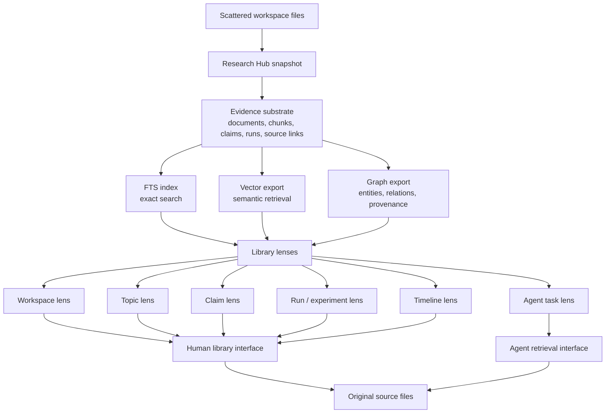
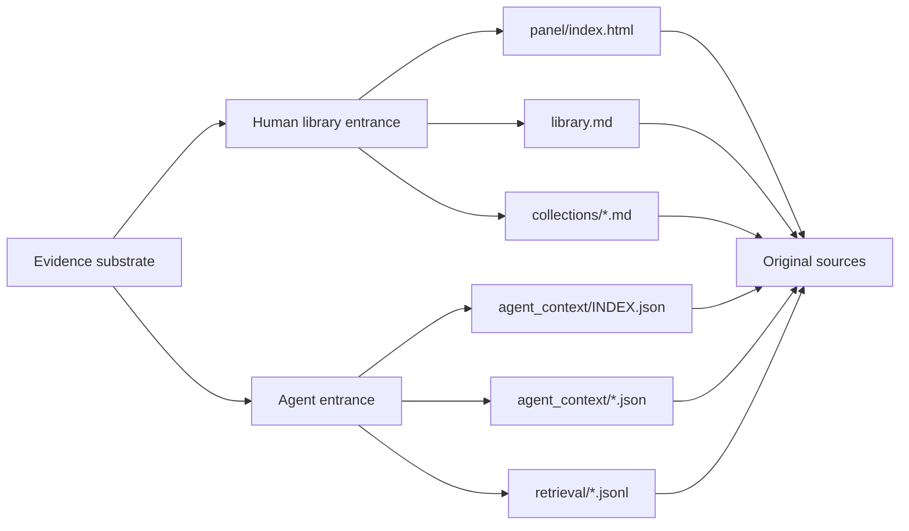

# Research Library Substrate Design

## Goal

Design the next layer of `research-hub-skills`: a Research Library Substrate
that lets humans and agents view scattered research workspaces as one library
without moving or reorganizing the original files.

## Core Idea

Research Hub should not force one primary browsing mode. A researcher may want
to browse by workspace, topic, claim, run, timeline, or task. An agent may want
to retrieve by semantic similarity, exact keyword match, provenance graph, or a
focused task pack.

The right substrate is therefore not a single panel. It is a shared evidence
model with multiple retrieval indexes and multiple lenses.



## Non-Goals

- Do not move or reorganize original workspace files.
- Do not require a vector database or graph database for the core package.
- Do not make generated context the source of truth.
- Do not turn Research Hub into an autonomous ML agent.
- Do not make DCASE2026 the only supported domain shape.

## Source Of Truth

Original workspace files remain authoritative. Every generated record, lens, and
retrieval export must preserve a path back to source evidence.

Generated outputs may summarize, cluster, rank, or enrich evidence. They must
not silently replace it.

## Evidence Model

The current core already produces:

- `documents.jsonl`
- `document_chunks.jsonl`
- `source_links.jsonl`
- `search_index.sqlite`

Profile-enabled runs add:

- `runs.jsonl`
- `claims.jsonl`
- `manifest.json`
- `agent_context/*.json`

The substrate should evolve toward these portable records:

| Record | Purpose | Required provenance |
| --- | --- | --- |
| `documents.jsonl` | File-level evidence inventory. | `workspace_id`, `source_path`, `sha1` |
| `document_chunks.jsonl` | Retrieval units for text. | `chunk_id`, `source_path`, `sha1` |
| `claims.jsonl` | Claim-like evidence with scope and class. | `evidence_paths` |
| `runs.jsonl` | Run, experiment, trial, or study-like entities. | `documents` |
| `source_links.jsonl` | Backlinks from generated records to source files. | `source_path`, `sha1` |
| `manifest.json` | Snapshot metadata. | `workspace_id`, `profile`, counts |
| `entities.jsonl` | Future graph nodes for people, methods, datasets, metrics, branches, machines, or topics. | `evidence_paths` |
| `relations.jsonl` | Future graph edges between entities, claims, runs, and documents. | `evidence_paths` |

## Retrieval Indexes

### FTS

The built-in SQLite FTS index remains the baseline. It supports exact and
near-exact lookup without external services.

Use cases:

- Find a metric string.
- Find a file by phrase.
- Locate exact method, run, branch, or config mentions.

### Vector Export

Vector retrieval should begin as a file-based export, not a required backend.
The core should write embedding-ready records that downstream tools can load
into Chroma, Qdrant, LanceDB, FAISS, or another vector store.

Proposed file:

```text
_research_context/retrieval/vector_records.jsonl
```

Each record should include:

```json
{
  "id": "workspace/main6/status.md::0",
  "text": "chunk text",
  "metadata": {
    "workspace_id": "dcase2026",
    "source_path": "workspace/main6/status.md",
    "sha1": "...",
    "record_type": "chunk",
    "profile": "dcase2026",
    "tags": ["noiseaware"],
    "claim_type_hint": "deployable"
  }
}
```

The export should not compute embeddings in v0.1. It should define a stable
record contract that vector backends can consume.

### Graph Export

Graph retrieval should also begin as a file-based export.

Proposed files:

```text
_research_context/retrieval/graph_nodes.jsonl
_research_context/retrieval/graph_edges.jsonl
```

Nodes may represent:

- workspace
- document
- chunk
- claim
- run
- metric
- topic
- profile-specific entity

Edges may represent:

- document contains chunk
- claim supported by document
- run uses document
- run reports metric
- entity mentioned in document
- snapshot generated from workspace

Every edge that asserts evidence must include `evidence_paths`.

## Library Lenses

Lenses are views over the same evidence substrate. They should not duplicate
authority. They decide ordering, grouping, and reading paths.

### Workspace Lens

Groups evidence by workspace, host, project folder, or source root.

Useful for:

- Understanding where evidence came from.
- Comparing machines or clones.
- Auditing generated context.

### Topic Lens

Groups evidence by inferred topics, tags, methods, datasets, or keywords.

Useful for:

- Browsing a research area without caring which workspace produced it.
- Finding related notes across machines.
- Feeding semantic retrieval.

### Claim Lens

Groups claims by class, scope, evidence, and status.

Useful for:

- Distinguishing deployable, diagnostic, oracle, negative, and unknown claims.
- Preventing unsupported claims from leaking into reports.
- Giving agents a safe summary surface.

### Run / Experiment Lens

Groups run-like records by status, metric, source documents, and profile.

Useful for:

- Comparing experiment evidence.
- Resuming work.
- Finding blocked or stale runs.

### Timeline Lens

Groups snapshots, documents, events, runs, and claims by time.

Useful for:

- Seeing how knowledge changed.
- Debugging stale conclusions.
- Reviewing recent progress.

### Agent Task Lens

Groups context by task intent.

Useful for:

- Summarize current state.
- Find evidence for a claim.
- Plan next experiment.
- Patch documentation.
- Prepare a report.

This lens should remain conservative until the evidence model is stable. It can
start as `agent_context/INDEX.json` with recommended read order and source
policy.

## Human And Agent Entrances

The substrate should produce two entrances from the same evidence:



Human-facing outputs should be browsable. Agent-facing outputs should be stable,
machine-readable, and explicit about source policy.

## First Implementation Slice

The first slice should be file-based and dependency-free:

1. Add `agent_context/INDEX.json` as the machine-readable startup entry.
2. Add `_research_context/retrieval/vector_records.jsonl` as an embedding-ready
   export over chunks.
3. Add `_research_context/retrieval/graph_nodes.jsonl` and
   `_research_context/retrieval/graph_edges.jsonl` as provenance graph exports.
4. Add `_research_context/library.md` as a simple human library entrance.
5. Keep `panel/index.html` as the richer human view.

This slice gives humans and agents multiple lenses without committing to a
specific vector database, graph database, or UI framework.

## Error Handling

- If a profile does not emit `claims.jsonl` or `runs.jsonl`, retrieval exports
  should still be generated from documents and chunks.
- If a source file disappears, generated records should not invent replacement
  evidence.
- If an inferred field is uncertain, use `unknown` or omit the field.
- If a downstream vector or graph backend fails, the file-based exports should
  still remain valid.

## Testing Strategy

Use TDD for implementation:

1. Write tests that publish a generic workspace and assert:
   - `agent_context/INDEX.json` exists.
   - `retrieval/vector_records.jsonl` contains chunk records.
   - `retrieval/graph_nodes.jsonl` contains document nodes.
   - `retrieval/graph_edges.jsonl` contains document-to-chunk edges.
   - `library.md` links to source paths.
2. Write tests that publish a DCASE profile workspace and assert:
   - claim and run nodes appear in graph exports.
   - vector records preserve profile metadata.
   - `agent_context/INDEX.json` includes profile-specific context packs.
3. Run existing tests to preserve generic and DCASE behavior.

## Design Decisions

These decisions constrain the first implementation slice:

1. `retrieval/` should be generated in the hub context mirror and then copied
   into each workspace `_research_context/`, matching the existing context
   projection model.
2. `library.md` should be generated for every workspace context first. A global
   hub library can be added after per-workspace behavior is stable.
3. `agent_context/INDEX.json` should be profile-neutral with optional
   `profile_sections`. Profiles may add sections, but the top-level contract
   stays stable.
4. Graph exports should start with simple document, chunk, claim, and run IDs.
   Rich entity extraction can be added later without breaking the first graph
   contract.

## Acceptance Criteria For The Design

- The core remains domain-neutral.
- DCASE2026 remains one optional profile example.
- The substrate supports human and agent interfaces from the same evidence.
- Vector and graph work starts as portable file exports.
- Every generated view preserves source provenance.
