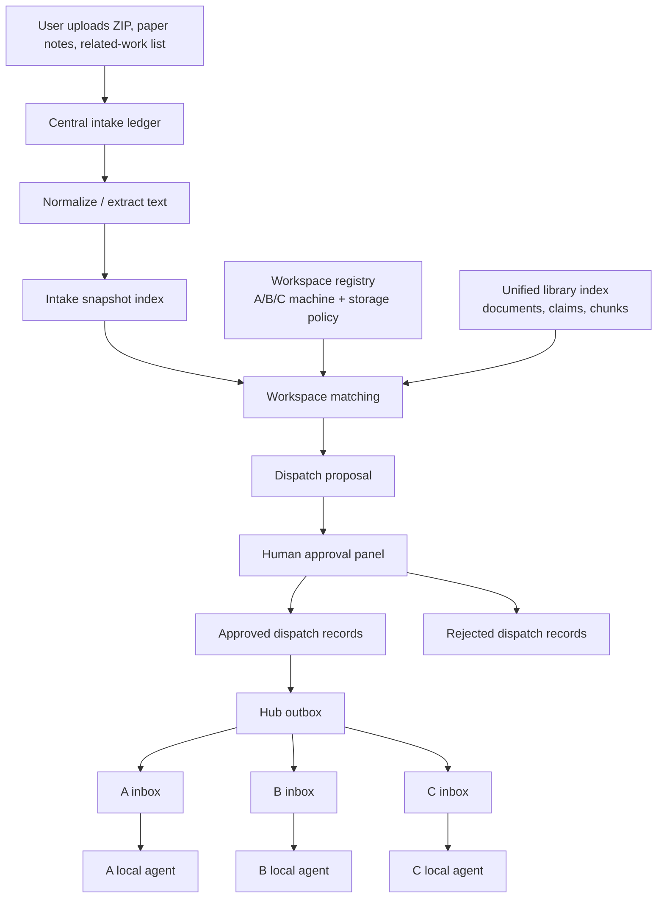

# Intake Dispatch OSS Design

## Goal

Design the first working loop for Research Hub capability 2:

1. A user uploads material once into a central hub.
2. The hub indexes the material without touching original workspace paths.
3. The hub proposes where the material should go across A/B/C workspaces.
4. The user approves or rejects each proposal.
5. Approved requests are delivered to per-workspace inboxes so local agents can
   continue the work.

The design must prefer MIT or Apache-2.0 open-source libraries where they reduce
implementation risk, but the Research Hub core should remain a small file-based
control plane.

## Evidence From Demo ZIP

The sample archive `dcase2026_deep_design_impl_repos (1).zip` was unpacked into
an inspection directory and published with the existing DCASE profile.

Observed output:

- `75` indexed files.
- `16` extracted claims.
- Branch-specific agent contexts for `main25`, `main26`, `main27`, and
  `main28`.
- Static panel and `research_state.md` generated successfully.
- Smoke test partially passed, then stopped because `torch` was not installed.

This proves the read side can already turn an uploaded repo bundle into a
library surface for agents and humans. It also shows why dispatch needs machine
capability metadata: torch-heavy work should be routed to a workspace that can
run it, not merely to a textually similar repository.

## Design Position

Research Hub should not become a monolithic app. It should be a control plane
over distributed workspaces:

- Core: file contracts, provenance, approval, routing records.
- Optional adapters: document conversion, vector search, API server, analytics.
- Local agents: execute only approved inbox requests in their own workspace.

The core must work without internet access, vector databases, graph databases,
or a web server. External libraries are welcome when they are optional and
license-compatible.

Strategically, this is an agent-driven lazy workspace skill, not a driver
server. The hub should know enough to index, route, propose, and audit work, but
it should not pretend to own every machine or eagerly synchronize every file.
Each workspace stays mostly asleep until a relevant approved request appears in
its inbox. Then the local agent wakes up with the right context, reads source
evidence from the hub or local workspace, and decides the concrete edit or
experiment plan inside that workspace.

This framing keeps the system efficient:

- no always-on central orchestrator is required,
- no B/C SSD storage is consumed for central library blobs by default,
- no original workspace path is modified during intake or proposal,
- no workspace-local work starts before human approval,
- agents can still see the distributed research estate as one library.

## Minimum Architecture



## Core Data Contracts

### Workspace Registry

The registry tells the hub what each workspace is allowed to do.

```json
{
  "workspace_id": "B",
  "machine_role": "4080",
  "root_hint": "\\\\b-machine\\research\\workspace-b",
  "tailnet_hint": "b-machine.tailnet",
  "storage_role": "research_ssd",
  "can_store_library_blobs": false,
  "can_run_training": true,
  "capabilities": ["torch", "cuda", "dcase2026"],
  "inbox_path": "inbox/B"
}
```

Rules:

- A can be the preferred archive because it has the 14TB HDD.
- B/C can receive lightweight requests and source references by default.
- B/C must not receive large blob copies unless explicitly approved.
- Registry records are generated hub state, not modifications to original repos.

### Intake Item

Each upload creates an immutable intake item.

```json
{
  "item_id": "intake_20260501_001",
  "kind": "zip_bundle",
  "title": "dcase2026 deep design implementation repos",
  "blob_root": "intake/blobs/intake_20260501_001",
  "created_at": "2026-05-01T02:20:10+09:00",
  "sha1": "...",
  "source_label": "user_upload",
  "status": "indexed"
}
```

Rules:

- The blob is stored in the central hub, preferably on A's HDD.
- Derived text, chunks, claims, and summaries point back to this item.
- Intake does not write into A/B/C workspace roots.

### Dispatch Proposal

The proposal ranks candidate destinations and explains the evidence.

```json
{
  "proposal_id": "proposal_20260501_001",
  "item_id": "intake_20260501_001",
  "recommended_targets": [
    {
      "workspace_id": "A",
      "action": "archive_and_index",
      "confidence": 0.92,
      "reason": "large multi-repo bundle; A has archive HDD"
    },
    {
      "workspace_id": "B",
      "action": "review_main26_torch_repos",
      "confidence": 0.81,
      "reason": "contains main26 dual-path torch code; B has 4080 + torch"
    }
  ],
  "requires_approval": true,
  "status": "pending"
}
```

Rules:

- Proposals are suggestions, never writes.
- Every reason must cite registry fields or indexed evidence.
- A proposal may target multiple workspaces with different actions.

### Inbox Request

After approval, the hub emits a local-agent-readable request.

```json
{
  "request_id": "request_20260501_001_B",
  "proposal_id": "proposal_20260501_001",
  "workspace_id": "B",
  "action": "review_and_integrate",
  "source_refs": [
    {
      "item_id": "intake_20260501_001",
      "path": "intake/blobs/intake_20260501_001/main26_enta_dualpath_nearfar"
    }
  ],
  "instructions": "Inspect main26 dual-path code and decide whether it should be integrated with workspace B experiments.",
  "status": "pending"
}
```

Rules:

- Local agents read inbox records and decide the concrete workspace edit plan.
- Large blobs can remain central; inbox requests may carry references.
- Completion, rejection, or follow-up records are written back as audit trail.

## OSS Reuse Strategy

Research Hub should reuse permissive OSS as optional adapters. It should not
copy code unless attribution and license notices are added.

| Area | Candidate | License | Use in Research Hub |
| --- | --- | --- | --- |
| Document conversion | [Microsoft MarkItDown](https://github.com/microsoft/markitdown) | MIT | Optional converter for PDF, Office, audio metadata, ZIP traversal into Markdown-like intake text. |
| Document parsing | [Unstructured](https://github.com/Unstructured-IO/unstructured) | Apache-2.0 | Optional heavier ETL path for PDFs, DOCX, HTML, tables, OCR-like workflows. |
| API / upload panel | [FastAPI](https://github.com/fastapi/fastapi) | MIT | Optional local server for upload, approval, and inbox browsing. |
| Validation | [Pydantic](https://github.com/pydantic/pydantic) | MIT | Optional strict schema validation for registry, proposal, approval, and inbox records. |
| Local analytics | [DuckDB](https://github.com/duckdb/duckdb) | MIT | Optional query layer over JSONL/Parquet state for reports and auditing. |
| Vector index | [LanceDB](https://github.com/lancedb/lancedb) | Apache-2.0 | Optional embedded vector backend for `vector_records.jsonl`. |
| Vector index | [Chroma](https://github.com/chroma-core/chroma) | Apache-2.0 | Optional alternative vector backend. |
| Agent/retrieval framework | [LangChain](https://github.com/langchain-ai/langchain) | MIT | Optional integration surface for loaders/retrievers, not a required runtime. |

Decision:

- P0 implementation uses Python standard library JSONL and SQLite FTS only.
- MarkItDown and Pydantic are the first optional dependencies to consider.
- LanceDB/Chroma/DuckDB/FastAPI are P1 adapters after the file contracts settle.
- No GPL/AGPL components enter the core package.

## Matching Heuristic For P0

The first dispatch proposal engine can be deterministic:

1. Read workspace registry.
2. Read current library manifests, documents, claims, and chunks.
3. Read intake item documents, claims, tags, dependency hints, and file names.
4. Score each workspace by:
   - topic/tag overlap,
   - branch or repo-name overlap,
   - required capability overlap such as `torch`, `cuda`, `dcase2026`,
   - storage policy compatibility,
   - historical evidence density in that workspace.
5. Emit top proposals with cited reasons.

This is enough for the ZIP example:

- Archive whole bundle on A because A has 14TB HDD.
- Route torch-heavy review to a 4080 workspace with torch capability.
- Route branch-specific docs to workspaces that already contain similar branch
  evidence.

## Human Approval Semantics

The approval gate is not decoration. It is the boundary that prevents unwanted
workspace writes.

Allowed states:

- `pending`
- `approved`
- `rejected`
- `dispatched`
- `accepted`
- `completed`
- `failed`

Only `approved` proposals can create outbox records. Only local workspace agents
can mark an inbox request as `accepted`, `completed`, or `failed`.

## Failure Handling

Failure cases must remain auditable:

- Unknown workspace: proposal is blocked until registry is fixed.
- Large blob targeting B/C SSD: proposal is blocked unless override approved.
- Missing dependency such as torch: proposal can still be sent as a setup or
  review request, but not as a runnable experiment request.
- Broken ZIP or unreadable files: intake item stays `failed_indexing` with
  diagnostic messages.
- Tailnet unavailable: outbox record stays pending and can be retried.

## Testing Strategy

Unit tests:

- Registry schema and storage policy validation.
- Intake item creation from a small fixture ZIP.
- Proposal scoring for A archive, B/C GPU, and branch-specific targets.
- Approval cannot dispatch rejected or pending proposals.
- Inbox request preserves provenance and source refs.

Integration test:

- Use a fixture shaped like the DCASE deep design ZIP.
- Publish it into an intake item.
- Generate proposal records.
- Approve one target.
- Verify an outbox file and workspace inbox file are created.
- Verify no original workspace source path was moved or modified.

## Non-Goals For First Loop

- No autonomous writes into original repos.
- No automatic git commits in A/B/C.
- No required vector database.
- No required web server.
- No full email integration yet; "workspace email" starts as an inbox directory
  protocol that can later be backed by email, Git, Syncthing, or tailnet paths.

## Implementation Order

1. Workspace registry.
2. Intake ledger and blob store.
3. Intake indexing from uploaded ZIP/folder.
4. Deterministic dispatch proposal engine.
5. Approval command.
6. Outbox and workspace inbox writer.
7. Static panel sections for intake/proposals/approval state.
8. Optional MarkItDown adapter for richer document formats.
9. Optional FastAPI panel.
10. Optional vector/DuckDB adapters.

## Open Decisions

- Whether B and C are represented as physical paths from the hub or as
  Git-backed inbox repositories.
- Whether the first panel remains static HTML or gains a local FastAPI server.
- Whether MarkItDown is installed by default in a `[docs]` extra or kept as a
  manually enabled plugin.
