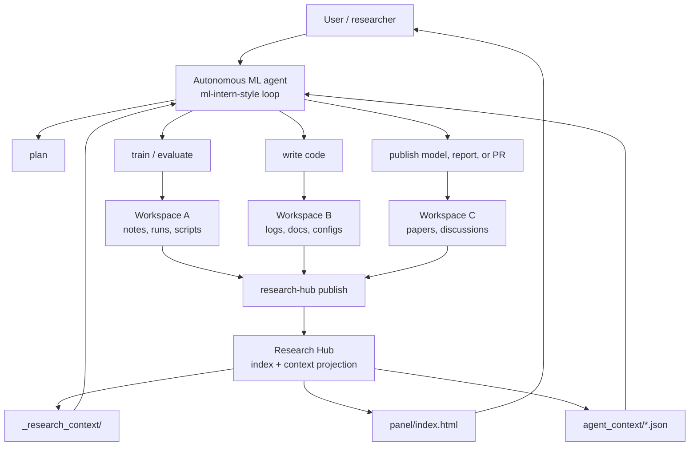
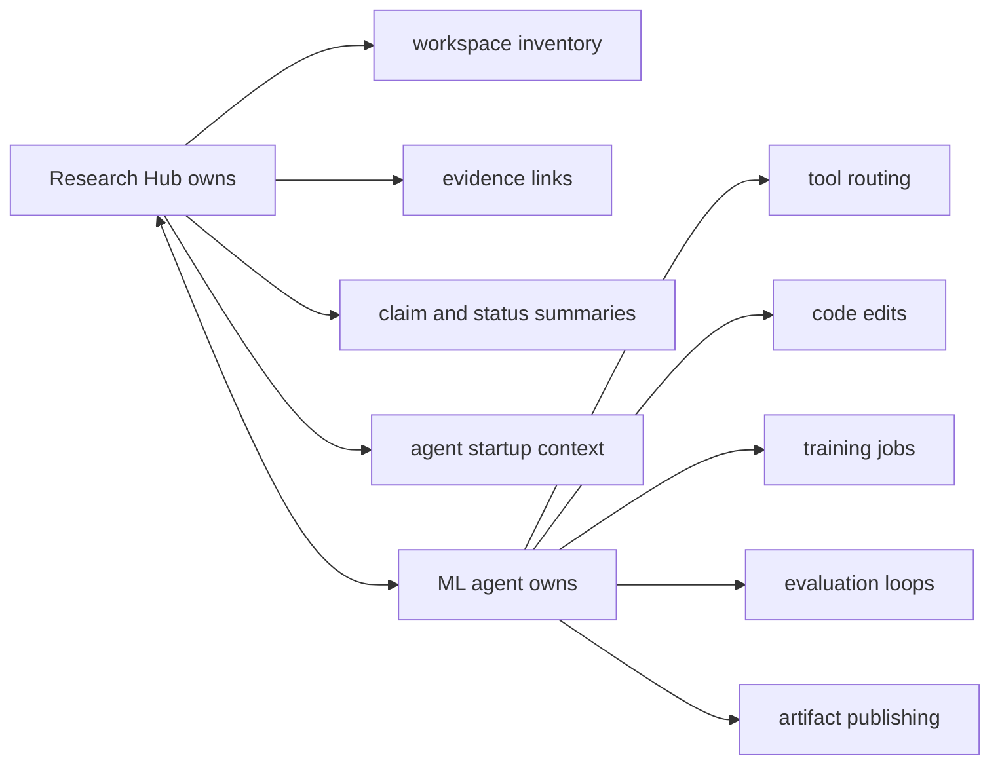
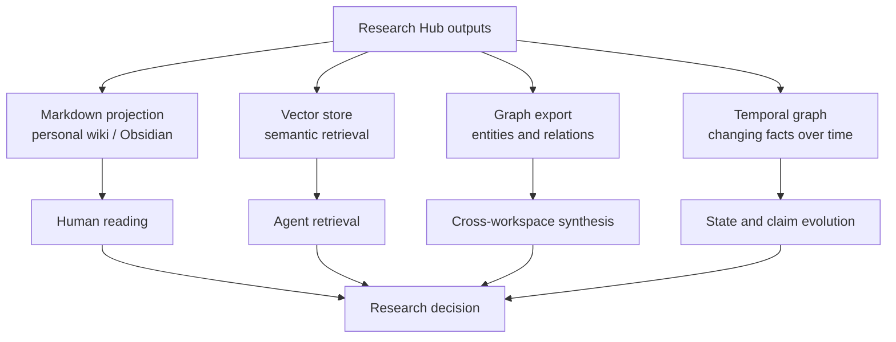

# Integrations

`research-hub-skills` is not an autonomous ML agent. It is the workspace context
substrate that an autonomous ML agent can read.

The guiding principle is:

> Keep scattered research workspaces scattered, but expose them through one
> stable agent-readable interface.

This makes the project complementary to `ml-intern`-style systems. Agents can
continue to plan, code, train, evaluate, and publish. Research Hub gives those
agents a durable map of local evidence, generated summaries, claims, runs, and
profile-specific context packs.

See `docs/oss-reuse.md` for the current open-source reuse policy. In short:
`ml-intern` is an architecture reference, while Graphiti-style temporal graph
memory and LanceDB-style vector search are better treated as optional adapter
targets rather than core dependencies.

## Agent Integration Model



The agent should not need to crawl every raw folder at startup. It should first
read `_research_context/START_HERE.md`, then use generated indexes and
profile-specific context packs to decide which original files deserve a deeper
read.

## Interface Contract For Agents

Agents should treat the generated hub as a read-optimized interface:

| File | Purpose |
| --- | --- |
| `_research_context/START_HERE.md` | Entry point for an agent starting in a workspace. |
| `_research_context/documents.jsonl` | File-level evidence inventory. |
| `_research_context/document_chunks.jsonl` | Chunk-level reading and retrieval surface. |
| `_research_context/search_index.sqlite` | Local SQLite FTS index for keyword search. |
| `_research_context/source_links.jsonl` | Links from generated records back to source evidence. |
| `_research_context/runs.jsonl` | Optional profile output for run-like entities. |
| `_research_context/claims.jsonl` | Optional profile output for claim-like evidence. |
| `_research_context/manifest.json` | Snapshot metadata for the generated index. |
| `panel/index.html` | Human-readable overview. |
| `panel/agent_context/*.json` | Profile-specific focused packs for agents. |

Generated files are navigation aids. Original workspace files remain the source
of truth.

## How This Complements ML Intern Style Agents

`ml-intern`-style agents need a reliable context layer for long-running research
loops. They typically need to:

1. understand the current workspace state,
2. locate relevant papers, datasets, code, logs, and prior results,
3. decide which experiments are worth running,
4. write or patch code,
5. run training or evaluation jobs,
6. summarize results and ship artifacts.

Research Hub should support steps 1, 2, 3, and 6 directly. The ML agent runtime
should own steps 4 and 5.



Research Hub should be boring, durable, and inspectable. Agent runtimes can be
ambitious and autonomous, but they should have to cite evidence paths when they
act on workspace state.

## Personal Wiki, Vector Store, And Graph Backends

The same generated interface can feed personal wiki and retrieval systems.



Recommended mapping:

| Research Hub output | Wiki use | Vector use | Graph use |
| --- | --- | --- | --- |
| `documents.jsonl` | source inventory pages | document metadata filters | document nodes |
| `document_chunks.jsonl` | excerpt pages | embedding units | evidence nodes |
| `claims.jsonl` | claim ledger | claim retrieval | claim nodes with evidence edges |
| `runs.jsonl` | experiment pages | run retrieval | run nodes linked to artifacts |
| `source_links.jsonl` | backlinks | provenance metadata | provenance edges |
| `manifest.json` | snapshot history | index version metadata | ingestion event node |

The first implementation should stay file-based. Vector stores and graphs can
be downstream consumers. That keeps the hub useful on a laptop, a shared folder,
or a Git-backed state repository without forcing a database dependency.

## Future Adapter Shape

Future integrations should be adapters over generated files, not replacements
for the core index.

```text
research-hub publish
  -> _research_context/*.jsonl
  -> adapter export-wiki
  -> adapter export-vector
  -> adapter export-graph
```

Suggested adapter responsibilities:

- `export-wiki`: render stable Markdown pages from hub records.
- `export-vector`: embed `document_chunks.jsonl` with provenance metadata.
- `export-graph`: turn documents, runs, claims, and source links into graph
  nodes and edges.
- `export-agent-context`: generate focused task packs for agent runtimes.

The core package should not require these backends. It should define the
portable evidence interface that lets those backends plug in cleanly.
