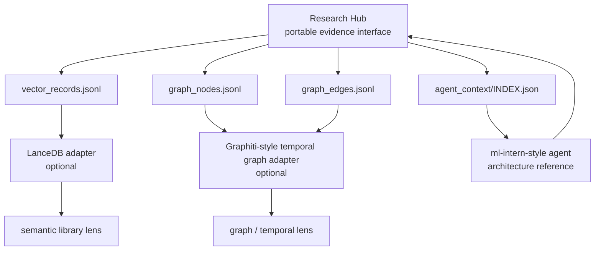

# Open Source Reuse Policy

Research Hub should reuse compatible open-source ideas and interfaces where
they help, but it should not blindly vendor large projects.

The preferred pattern is:

1. reuse architecture and interface ideas,
2. add lightweight adapters over Research Hub JSONL outputs,
3. only copy source code when the license is verified and attribution is added,
4. keep heavy vector, graph, and agent runtimes optional.

## UI Component Intake

UI components can be adopted only through a strict intake review so the core
stays lightweight, static-friendly, and license-safe.

### Allowed licenses

- Required allowlist: `MIT`, `Apache-2.0`.
- `GPL`/`AGPL` licensed code must not be included in the core package.

### Evaluation checklist

Before intake, evaluate and record:

- maintenance recency (recent commit and/or recent release activity),
- bundle size impact,
- ability to ship as a static build artifact,
- dependency count,
- published security advisory history.

### Required integration pattern

UI reuse must follow these rules:

1. prioritize `adapter + standalone static build`,
2. do not couple UI components to the core Python package,
3. render in read-only mode from `_research_context/panel/`.

## Candidate Matrix

| Project | License status checked | How to use it | Reuse level |
| --- | --- | --- | --- |
| `huggingface/ml-intern` | No license file found during review. Do not copy code. | Architecture reference for agent loop, tool routing, context management, and ML workflow ownership. | Ideas only |
| `getzep/graphiti` | Apache-2.0 license. | Reference for temporal graph memory, provenance, and evolving facts. Potential downstream graph backend. | Adapter-compatible |
| `lancedb/lancedb` | Apache-2.0 license. | Potential embedded vector backend for `vector_records.jsonl`. | Optional dependency / adapter |
| `microsoft/markitdown` | MIT license. | Optional intake converter for PDF, Office, HTML, ZIP traversal, and other uploaded research materials. | Optional dependency / adapter |
| `Unstructured-IO/unstructured` | Apache-2.0 license. | Optional heavier document ETL path for complex PDFs, DOCX, HTML, and table-heavy material. | Optional dependency / adapter |
| `fastapi/fastapi` | MIT license. | Optional local upload and approval server after file contracts stabilize. | Optional dependency / adapter |
| `pydantic/pydantic` | MIT license. | Optional strict schema validation for registry, intake, proposal, approval, outbox, and inbox records. | Optional dependency / adapter |
| `duckdb/duckdb` | MIT license. | Optional local analytics/query layer over JSONL/Parquet hub state for reports and audits. | Optional dependency / adapter |
| `chroma-core/chroma` | Apache-2.0 license. | Optional vector backend alternative for `vector_records.jsonl`. | Optional dependency / adapter |
| `langchain-ai/langchain` | MIT license. | Optional loader/retriever integration surface; not required for the core control plane. | Optional dependency / adapter |

## Immediate Decisions

- Do not copy `ml-intern` code unless a compatible license is explicitly
  verified later.
- Do not add Graphiti or LanceDB as core dependencies.
- Do not add MarkItDown, Unstructured, FastAPI, Pydantic, DuckDB, Chroma, or
  LangChain as core dependencies until a focused adapter needs them.
- Do define exports that these projects or similar tools can ingest:
  - `retrieval/vector_records.jsonl`
  - `retrieval/graph_nodes.jsonl`
  - `retrieval/graph_edges.jsonl`
  - `agent_context/INDEX.json`
  - `intake/items.jsonl`
  - `dispatch/proposals.jsonl`
  - `outbox/<workspace_id>/<request_id>.json`
  - `_research_context/inbox/pending/<request_id>.json`
- Keep attribution in this document and in any future adapter file that copies
  or derives code.

## Integration Direction

## Attribution Requirements

When code is copied or substantially adapted from another project:

1. preserve the upstream copyright notice,
2. add the upstream license file or relevant notice when required,
3. mention the source repository in the file header or adjacent documentation,
4. keep copied code isolated in an adapter module when possible,
5. avoid mixing incompatible licenses into the Apache-2.0 core.

For now, the implementation should use original code in this repository and
only design against compatible external interfaces.

See `docs/oss-ui-shortlist.md` for the current MIT/Apache-2.0 UI panel
candidate list and the recommended first adapter target.
