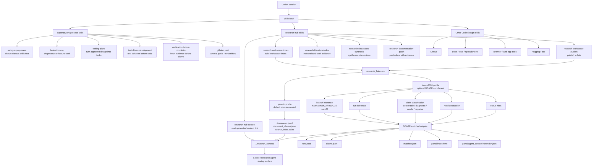
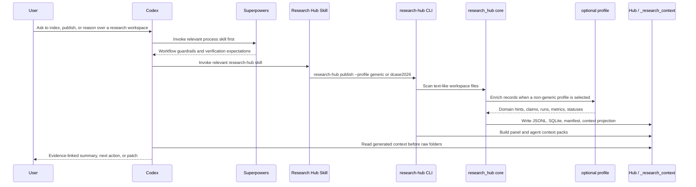

# Research Hub Skill Map

This document fixes the intended relationship between Superpowers process
skills, Codex/plugin skills, and the `research-hub-skills` package.

Process trail:

- Design: `docs/superpowers/specs/2026-04-30-research-hub-skill-map-design.md`
- Plan: `docs/superpowers/plans/2026-04-30-research-hub-skill-map.md`

The short version:

- Superpowers skills define how Codex should work.
- Research Hub skills define how Codex should read, index, and publish research
  workspace context.
- Optional profiles, such as `dcase2026`, add domain-specific interpretation
  without turning the core package into a domain-specific tool.

## Skill Ecosystem



## Publish Flow



## Responsibilities

| Layer | Responsibility | Should not do |
| --- | --- | --- |
| Superpowers | Control the work process: brainstorm, plan, test, verify, publish. | Encode DCASE research semantics. |
| Research Hub core | Index files, chunk text, build SQLite search, publish generated context. | Make domain-specific claims by default. |
| Generic profile | Preserve the domain-neutral default behavior. | Add branch, run, or claim assumptions. |
| `dcase2026` profile | Infer DCASE branches, runs, document roles, metrics, claim hints, and status hints. | Replace source files as the authority. |
| `_research_context/` | Give agents a generated startup reading surface. | Become the source of truth. |

## Invocation Policy

Use the default profile unless the workspace is explicitly DCASE2026-style:

```bash
research-hub publish --workspace-root . --profile generic
```

Use the DCASE2026 profile when branch/run/claim interpretation is useful:

```bash
research-hub publish --workspace-root . --profile dcase2026
```

When a DCASE profile output conflicts with source evidence, the source evidence
wins. Generated fields such as `claim_type_hint`, `status_hint`, and inferred
`branch` are navigation aids, not final research claims.
