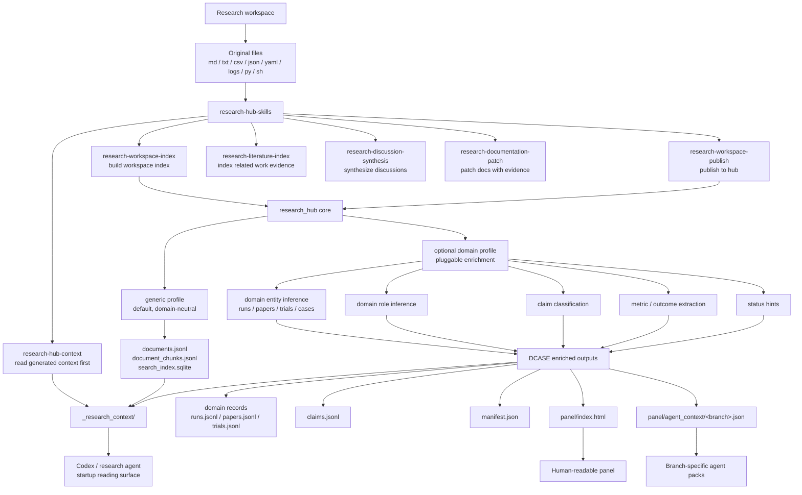
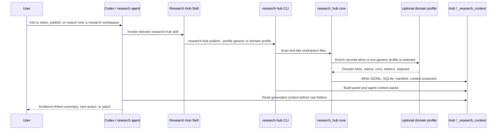
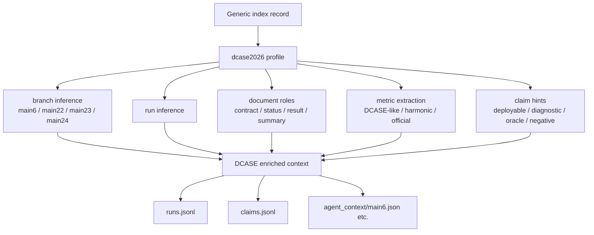

# Research Hub Skill Map

This document fixes the intended relationship between the Research Hub skills,
the `research_hub` package, generated context, and optional profiles.

The short version:

- Research Hub skills define how Codex should read, index, and publish research
  workspace context.
- Optional profiles add domain-specific interpretation without turning the core
  package into a domain-specific tool.
- `dcase2026` is an appendix example of that profile mechanism.

For autonomous ML agent, personal wiki, vector store, and graph memory
integration patterns, see `docs/integrations.md`.

## Skill Ecosystem



## Publish Flow



## Responsibilities

| Layer | Responsibility | Should not do |
| --- | --- | --- |
| Research Hub skills | Tell agents how to read, index, publish, synthesize, and patch research context. | Replace source evidence with generated summaries. |
| Research Hub core | Index files, chunk text, build SQLite search, publish generated context. | Make domain-specific claims by default. |
| Generic profile | Preserve the domain-neutral default behavior. | Add branch, run, or claim assumptions. |
| Domain profile | Infer domain entities, roles, metrics or outcomes, claim hints, and status hints. | Replace source files as the authority. |
| `_research_context/` | Give agents a generated startup reading surface. | Become the source of truth. |

## Invocation Policy

Use the default profile unless the workspace is explicitly DCASE2026-style:

```bash
research-hub publish --workspace-root . --profile generic
```

Use the DCASE2026 profile when branch/run/claim interpretation is useful:

```bash
research-hub publish --workspace-root . --profile dcase2026
```

When a DCASE profile output conflicts with source evidence, the source evidence
wins. Generated fields such as `claim_type_hint`, `status_hint`, and inferred
`branch` are navigation aids, not final research claims.

## Appendix: DCASE2026 profile


