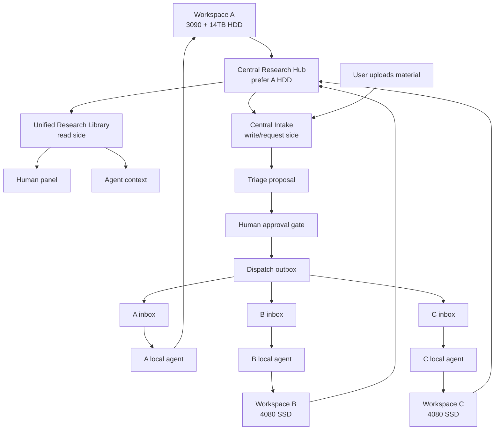

# Distributed Research Control Plane Implementation Plan

> **For agentic workers:** REQUIRED SUB-SKILL: Use superpowers:subagent-driven-development (recommended) or superpowers:executing-plans to implement this plan task-by-task. Steps use checkbox (`- [ ]`) syntax for tracking.

**Goal:** Build a distributed research control plane where scattered workspaces remain untouched, but humans and agents can read them as one library and dispatch approved work requests to the right local workspace agents.

**Architecture:** Split the system into a read side and a write/request side. The read side indexes A/B/C workspaces into a unified library substrate. The write side accepts uploaded material into a central intake, proposes target workspaces, waits for approval, and then emits per-workspace inbox requests for local agents.

**Tech Stack:** Python standard library first, JSONL control files, Markdown/HTML panels, local/shared/Git-backed hub modes, optional future vector and temporal graph adapters.

---

## Problem Definition

The user has multiple research workspaces:

- Workspace A on a 3090 machine.
- Workspaces B and C on 4080 machines.
- A, B, and C may be local or on different machines, but they are reachable over a tailnet.
- A has the only 14TB HDD.
- B and C SSD space must remain for active research, not central library storage.
- Each workspace can contain many repositories, Markdown files, text files, logs, docs folders, and partially organized research notes.

The system must preserve original paths and folder structure. Generated context,
indexes, panels, queues, and proposals may point back to original files, but
they must not silently move or rewrite source evidence.

The user wants two capabilities:

1. Agents can understand ongoing research across A/B/C and write integrated
   reports without scanning every raw folder manually.
2. The user can upload material once into a central panel. The system proposes
   which workspace should receive which material. After human approval, the
   request is delivered to that workspace's local inbox so its local agent can
   continue the work.

## System Boundary



## Progress Summary

| Area | Priority | Progress | Status | Notes |
| --- | --- | ---: | --- | --- |
| Core workspace indexing | P0 | 55% | In progress | Basic `publish`, JSONL chunks, SQLite FTS, DCASE profile exist. |
| Unified read-side library substrate | P0 | 35% | Planned | Design and implementation plan exist; first code slice still pending. |
| Workspace registry for A/B/C | P0 | 80% | Minimal implementation complete | Models machine, storage role, inbox path, and capabilities. Needs richer validation and sync policy. |
| Central intake and upload ledger | P0 | 75% | Minimal implementation complete | Copies files/folders/ZIPs into hub blob store and records `intake/items.jsonl`. |
| Dispatch proposal and approval gate | P0 | 65% | Minimal implementation complete | Deterministic proposal scoring and approval command exist. Needs richer evidence citations. |
| Per-workspace inbox protocol | P0 | 65% | Minimal implementation complete | Approved requests write hub outbox and workspace inbox JSON files. Needs status return flow. |
| Human library/control panel | P1 | 55% | Minimal WebUI implemented | Static panel plus tiny server-rendered WebUI for registry, intake, proposal, and approval. Needs richer UX and status views. |
| Agent startup interface | P1 | 20% | Planned | `agent_context/INDEX.json` planned, not implemented. |
| Manifest-first index collection | P0/P1 | 55% | Minimal implementation complete | `collect-index` skips unchanged snapshots by `root_hash`; WebUI shows freshness. SSH/rsync remote pull remains next. |
| Vector and graph export records | P1 | 10% | Planned | Spec exists; file-based exports not implemented. |
| SSH/local transport | P0/P1 | 55% | Minimal implementation complete | `local_path` writes directly; `ssh` records dry-run commands and can execute with `--execute-transport`. Status return still pending. |
| Tailnet/Git sync transport | P2 | 10% | Deferred | Tailnet paths and Git-backed state hub remain optional after SSH baseline. |
| Optional external adapters | P3 | 0% | Deferred | LanceDB/Graphiti-style adapters remain optional. |

## Prioritized Workstreams

### P0.1: Workspace Registry

**Why:** The hub cannot route reports, uploads, or requests without knowing what A/B/C are and what each machine is allowed to store.

**Files to create or modify:**

- Create: `src/research_hub/registry.py`
- Create: `tests/test_workspace_registry.py`
- Modify: `src/research_hub/cli.py`
- Document: `docs/workspace-registry.md`

**Target outputs:**

```text
<hub>/registry/workspaces.json
_research_context/workspace_registry.json
```

**Minimum schema:**

```json
{
  "workspaces": [
    {
      "workspace_id": "A",
      "machine_role": "3090",
      "storage_role": "archive_hdd",
      "root_hint": "/path/to/A",
      "tailnet_hint": "a-machine.tailnet",
      "inbox_path": "inbox/A",
      "can_store_library_blobs": true,
      "can_run_training": true
    },
    {
      "workspace_id": "B",
      "machine_role": "4080",
      "storage_role": "research_ssd",
      "root_hint": "/path/to/B",
      "tailnet_hint": "b-machine.tailnet",
      "inbox_path": "inbox/B",
      "can_store_library_blobs": false,
      "can_run_training": true
    }
  ]
}
```

**Detailed tasks:**

- [ ] Add `research-hub registry init --hub <path>` to create an empty registry.
- [ ] Add `research-hub registry add --workspace-id A --machine-role 3090 --storage-role archive_hdd --root-hint <path> --tailnet-hint <host>`.
- [ ] Add validation that only `archive_hdd` workspaces can store large library blobs.
- [ ] Copy registry summary into `_research_context/workspace_registry.json`.
- [ ] Test that B/C with `research_ssd` cannot be selected as default blob archive targets.

**Progress:** 80% minimal code complete; richer validation and context copy remain.

### P0.2: Read-Side Unified Library Snapshot

**Why:** Agents cannot write integrated reports unless they can read A/B/C as one indexed library.

**Files to create or modify:**

- Continue from: `docs/superpowers/plans/2026-04-30-research-library-substrate.md`
- Create: `src/research_hub/library.py`
- Create: `tests/test_library_outputs.py`
- Modify: `src/research_hub/cli.py`
- Modify: `src/research_hub/indexer.py`

**Target outputs:**

```text
_research_context/agent_context/INDEX.json
_research_context/library.md
_research_context/retrieval/vector_records.jsonl
_research_context/retrieval/graph_nodes.jsonl
_research_context/retrieval/graph_edges.jsonl
```

**Detailed tasks:**

- [ ] Implement generic `agent_context/INDEX.json`.
- [ ] Implement `library.md` listing source-backed documents, claims, and runs.
- [ ] Implement vector-ready records over chunks with provenance metadata.
- [ ] Implement graph nodes/edges for workspace, document, chunk, claim, and run.
- [ ] Ensure all outputs are copied from hub context mirror into each workspace `_research_context/`.
- [ ] Run generic and DCASE tests.

**Progress:** 35% design complete, 0% code complete.

### P0.3: Central Intake Ledger

**Why:** The user needs one panel where related work, notes, or task ideas can be uploaded without manually pasting into A/B/C.

**Files to create or modify:**

- Create: `src/research_hub/intake.py`
- Create: `tests/test_intake.py`
- Modify: `src/research_hub/cli.py`
- Document: `docs/intake-dispatch.md`

**Target outputs:**

```text
<hub>/intake/items.jsonl
<hub>/intake/blobs/<item_id>/
<hub>/panel/intake.html
```

**Minimum intake record:**

```json
{
  "item_id": "2026-05-01-related-work-001",
  "created_at": "2026-05-01T00:00:00+09:00",
  "kind": "related_work_note",
  "title": "New source separation papers",
  "body_path": "intake/blobs/2026-05-01-related-work-001/body.md",
  "source_files": [],
  "status": "new",
  "user_intent": "Attach this to the workspace where it helps next experiments most."
}
```

**Detailed tasks:**

- [ ] Add `research-hub intake add --hub <path> --title <title> --body-file <file> --kind <kind>`.
- [ ] Store uploaded body/files under `<hub>/intake/blobs/<item_id>/`.
- [ ] Append metadata to `<hub>/intake/items.jsonl`.
- [ ] Render new intake items in `panel/intake.html`.
- [ ] Do not write to A/B/C workspaces during intake.

**Progress:** 75% minimal code complete; richer document conversion adapters remain.

### P0.4: Dispatch Proposal Engine

**Why:** The system must recommend where uploaded material belongs, but not act without approval.

**Files to create or modify:**

- Create: `src/research_hub/dispatch.py`
- Create: `tests/test_dispatch.py`
- Modify: `src/research_hub/cli.py`
- Document: `docs/intake-dispatch.md`

**Target outputs:**

```text
<hub>/dispatch/proposals.jsonl
<hub>/dispatch/pending/<proposal_id>.json
```

**Minimum proposal record:**

```json
{
  "proposal_id": "proposal-2026-05-01-001",
  "item_id": "2026-05-01-related-work-001",
  "status": "pending_approval",
  "recommended_targets": [
    {
      "workspace_id": "A",
      "reason": "Contains related source-law notes and archive HDD can store supporting material.",
      "suggested_action": "append_to_related_work",
      "target_hint": "docs/related_work/"
    },
    {
      "workspace_id": "B",
      "reason": "Has active 4080 experiments that can use the summary without storing large blobs.",
      "suggested_action": "create_task_request",
      "target_hint": "inbox/"
    }
  ],
  "requires_human_approval": true
}
```

**Detailed tasks:**

- [ ] Add `research-hub dispatch propose --hub <path> --item-id <id>`.
- [ ] Rank candidate workspaces using registry metadata, existing claims/runs/docs, and storage policy.
- [ ] Emit proposal JSON without modifying workspace files.
- [ ] Add reasons and source evidence used for the recommendation.
- [ ] Render pending proposals in the panel.

**Progress:** 65% minimal code complete; richer ranking and evidence citations remain.

### P0.5: Approval Gate And Workspace Outbox

**Why:** Writes must be explicit, auditable, and approved by the human before a local agent acts.

**Files to create or modify:**

- Continue: `src/research_hub/dispatch.py`
- Create: `tests/test_approval_outbox.py`
- Modify: `src/research_hub/cli.py`

**Target outputs:**

```text
<hub>/dispatch/approved.jsonl
<hub>/outbox/<workspace_id>/<request_id>.json
```

**Detailed tasks:**

- [ ] Add `research-hub dispatch approve --hub <path> --proposal-id <id> --target A`.
- [ ] Copy approved action into `<hub>/outbox/A/<request_id>.json`.
- [ ] Preserve `item_id`, proposal reasons, approval timestamp, target workspace, and source blob paths.
- [ ] Keep approved blobs on A HDD when they are large library artifacts.
- [ ] For B/C, send lightweight request metadata and references to A-hosted blobs when possible.

**Progress:** 65% minimal code complete; rejection flow and proposal status mutation remain.

### P0.6: Per-Workspace Inbox Protocol

**Why:** Local agents on A/B/C need a small, predictable queue they can read and act on.

**Files to create or modify:**

- Create: `src/research_hub/inbox.py`
- Create: `tests/test_inbox.py`
- Modify: `src/research_hub/cli.py`
- Template: `templates/WORKSPACE_INBOX_PROTOCOL.md`

**Target outputs in each workspace:**

```text
_research_context/inbox/pending/*.json
_research_context/inbox/accepted/*.json
_research_context/inbox/completed/*.json
_research_context/inbox/rejected/*.json
```

**Detailed tasks:**

- [ ] Add `research-hub inbox pull --workspace-root <path> --hub <path> --workspace-id A`.
- [ ] Copy approved outbox requests into local `_research_context/inbox/pending/`.
- [ ] Add `research-hub inbox accept --request-id <id>` to move request to accepted.
- [ ] Add `research-hub inbox complete --request-id <id> --evidence-path <path>`.
- [ ] Ensure local agents must inspect source evidence before modifying original workspace files.
- [ ] Ensure rejected requests preserve reason and do not disappear.

**Progress:** 65% minimal code complete; local status return protocol remains.

## P1 Workstreams

### P1.1: Human Control Panel Views

**Progress:** 20%

- [ ] Show workspace registry.
- [ ] Show unified library.
- [ ] Show intake items.
- [ ] Show dispatch proposals.
- [ ] Show approval controls.
- [ ] Show outbox/inbox status.

### P1.2: Agent Report Writer Context Packs

**Progress:** 10%

- [ ] Generate report-writing context pack from A/B/C documents.
- [ ] Include source path citations.
- [ ] Include claim boundary reminders.
- [ ] Include per-workspace freshness metadata.

### P1.3: Storage Policy Enforcement

**Progress:** 0%

- [ ] Mark A as archive-capable.
- [ ] Mark B/C as research-SSD-only.
- [ ] Prevent B/C from becoming blob archive targets.
- [ ] Allow B/C to receive references to A-hosted blobs over tailnet.

## P2 Workstreams

### P2.1: Tailnet Transport

**Progress:** 0%

- [ ] Start with shared path or Git state hub.
- [ ] Document tailnet path conventions.
- [ ] Add transport abstraction only after file-based queues work.

### P2.2: Vector And Temporal Graph Adapters

**Progress:** 0%

- [ ] Keep core exports dependency-free.
- [ ] Add optional LanceDB-style vector adapter later.
- [ ] Add optional Graphiti-style temporal graph adapter later.

## Required Safety Rules

- [ ] Never move original workspace files automatically.
- [ ] Never write to A/B/C original paths during intake.
- [ ] Never dispatch without human approval.
- [ ] Never store large library blobs on B/C SSD by default.
- [ ] Every generated record must preserve source path provenance.
- [ ] Every local agent request must be auditable from intake item to proposal to approval to inbox result.

## Current Next Step

The next concrete implementation step is **P0.1 Workspace Registry**.

Reason:

Without a workspace registry, the system cannot know that A is the 3090 machine
with 14TB archive HDD, that B/C are 4080 research SSD workspaces, or where
dispatch inboxes should be written.

After P0.1, implement P0.2 read-side library outputs, then P0.3 intake.

## Verification Checklist For This Roadmap

- [x] Roadmap distinguishes read side from write/request side.
- [x] Roadmap includes A/B/C machine and storage constraints.
- [x] Roadmap keeps original paths authoritative.
- [x] Roadmap includes human approval before dispatch.
- [x] Roadmap includes per-workspace inbox protocol.
- [x] Roadmap gives explicit priorities and progress percentages.
